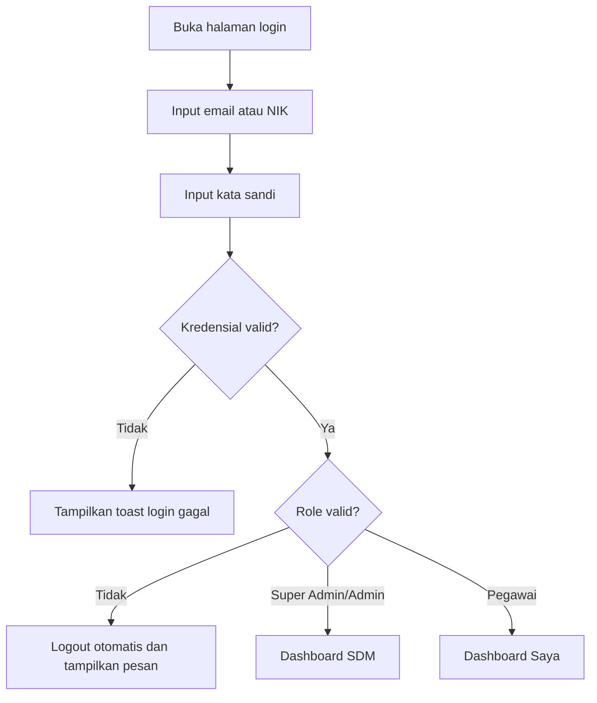
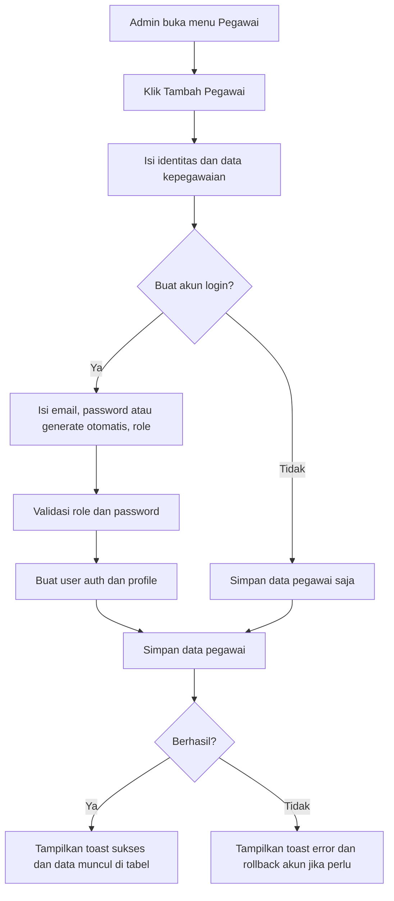
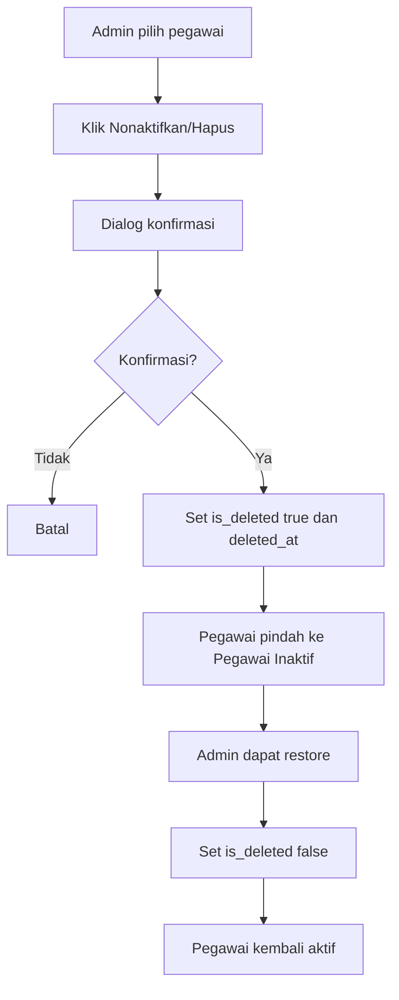
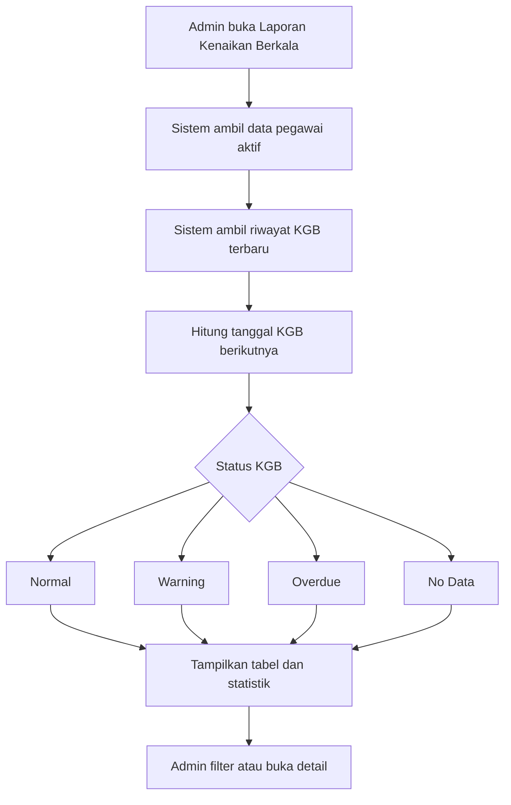
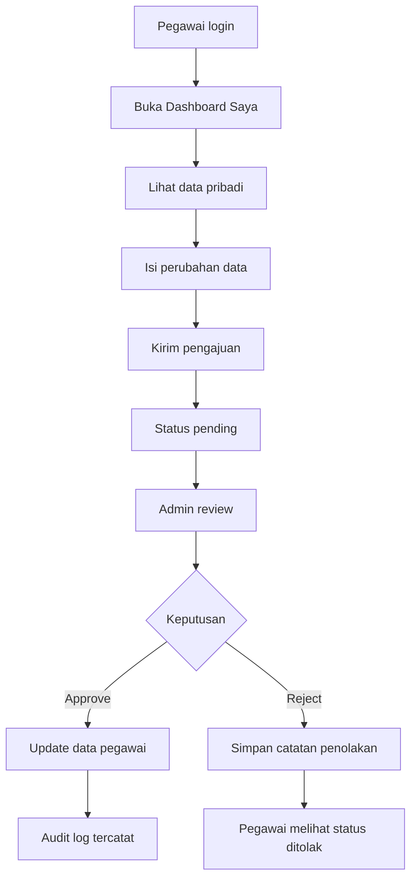
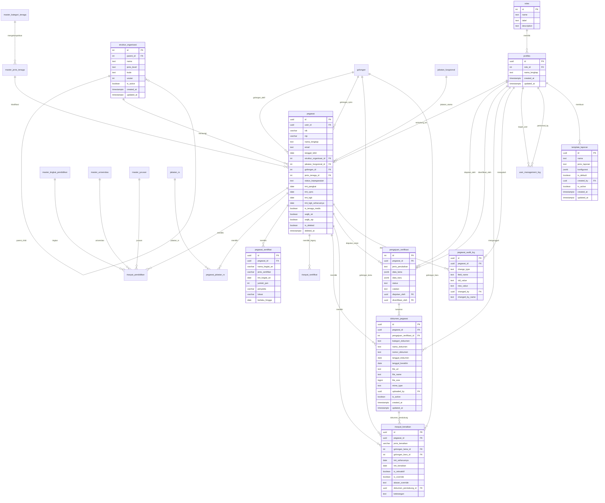
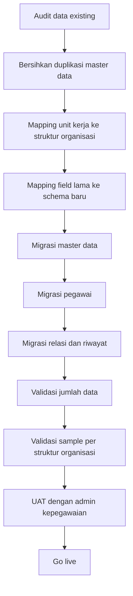

# Product Requirements Document (PRD)

# Sistem Informasi Manajemen Kepegawaian Rumah Sakit

Dokumen ini adalah PRD lengkap untuk membangun ulang aplikasi Sistem Informasi Manajemen Kepegawaian Rumah Sakit (SIMPEG RSUD). Isi dokumen disusun berdasarkan analisis aplikasi existing, struktur database, pola UI, role akses, dan kebutuhan umum sistem kepegawaian rumah sakit.

Dokumen ini dapat digunakan oleh product owner, analis sistem, UI/UX designer, backend engineer, frontend engineer, database engineer, QA, dan tim implementasi RSUD.

---

## 1. Informasi Dokumen

| Item | Nilai |
|---|---|
| Nama Produk | Sistem Informasi Manajemen Kepegawaian Rumah Sakit |
| Singkatan | SIMPEG RSUD |
| Jenis Dokumen | Product Requirements Document |
| Versi | 1.0 |
| Bahasa Produk | Bahasa Indonesia |
| Target Pengguna | RSUD / Rumah Sakit Pemerintah / Instansi Kesehatan |
| Platform | Web Application |
| Status | Draft lengkap untuk pengembangan aplikasi baru |
| Sumber Analisis | Aplikasi existing, schema database, README, design guideline, dan struktur source code |

---

## 2. Ringkasan Eksekutif

SIMPEG RSUD adalah aplikasi web untuk mengelola data kepegawaian rumah sakit secara terpusat, aman, terstruktur, dan dapat diaudit. Sistem ini menangani data pegawai, riwayat pendidikan, jabatan, golongan, sertifikat, STR/SIP, kenaikan gaji berkala (KGB), kenaikan pangkat, pensiun, master data, manajemen user, audit log, dan laporan SDM.

Aplikasi baru yang akan dibangun harus lebih lengkap, lebih mudah dipakai, lebih siap untuk operasional harian, dan mampu menjadi sumber data resmi kepegawaian rumah sakit.

Nilai utama produk:

- Satu sumber data pegawai yang rapi dan terpercaya.
- Proses administrasi kepegawaian lebih cepat dan terdokumentasi.
- Monitoring otomatis untuk KGB, kenaikan pangkat, pensiun, dan masa berlaku STR/SIP.
- Role-based access untuk membatasi akses sesuai tanggung jawab.
- Laporan SDM siap export ke Excel/PDF.
- Audit trail lengkap untuk akuntabilitas.

---

## 3. Latar Belakang Masalah

Pengelolaan kepegawaian rumah sakit memiliki kompleksitas tinggi karena melibatkan banyak jenis data dan aturan administratif. Data pegawai tidak hanya mencakup identitas dasar, tetapi juga status kepegawaian, unit kerja, jabatan, golongan, pendidikan, diklat, sertifikat profesi, STR/SIP, KGB, kenaikan pangkat, hingga pensiun.

Masalah yang umum terjadi:

- Data pegawai tersebar di banyak file dan tidak konsisten.
- Proses pembaruan data tidak memiliki riwayat perubahan yang jelas.
- Admin sulit mengetahui pegawai yang akan pensiun, naik pangkat, atau jatuh tempo KGB.
- Masa berlaku STR/SIP tenaga medis berisiko terlewat jika tidak dimonitor otomatis.
- Export laporan masih manual dan rentan kesalahan.
- Master data tidak standar sehingga nama jabatan, unit, pendidikan, dan jenis tenaga bisa duplikatif.
- Akses data belum selalu dibedakan berdasarkan role.
- Tidak semua perubahan data dapat diaudit.

SIMPEG RSUD baru harus menyelesaikan masalah tersebut dengan sistem yang lengkap, aman, terukur, dan mudah dikembangkan.

---

## 4. Tujuan dan Sasaran (Objectives)

### 4.1 Tujuan Produk

1. Membangun sistem kepegawaian rumah sakit yang menjadi sumber data resmi pegawai.
2. Mempermudah admin kepegawaian dalam mengelola data pegawai aktif dan nonaktif.
3. Mengotomatisasi peringatan administratif seperti KGB, kenaikan pangkat, pensiun, dan STR/SIP.
4. Menyediakan laporan SDM yang cepat, akurat, dan dapat diekspor.
5. Mengamankan data pegawai melalui autentikasi, otorisasi, RLS, dan audit log.
6. Memungkinkan pegawai melihat data pribadi dan mengajukan pembaruan data.
7. Menyediakan master data yang konsisten untuk seluruh proses administrasi.

### 4.2 Sasaran Bisnis

| Sasaran | Penjelasan |
|---|---|
| Sentralisasi Data | Semua data kepegawaian tersimpan dalam satu sistem utama. |
| Efisiensi Administrasi | Admin dapat mencari, mengubah, dan membuat laporan tanpa proses manual berulang. |
| Kepatuhan Administratif | KGB, pangkat, STR/SIP, dan pensiun dapat dimonitor sebelum jatuh tempo. |
| Akuntabilitas | Setiap perubahan data pegawai tercatat dalam audit log. |
| Kesiapan Pelaporan | Data dapat diekspor untuk kebutuhan internal, audit, atau pelaporan manajemen. |

### 4.3 Target Metrik Keberhasilan

| Metrik | Target Awal |
|---|---|
| Kelengkapan data pegawai aktif | Minimal 95 persen data pegawai aktif memiliki identitas, unit, status, dan jabatan. |
| Kecepatan pencarian pegawai | Hasil pencarian muncul kurang dari 2 detik untuk data operasional normal. |
| Akurasi laporan | Laporan sesuai filter dan data sumber dengan toleransi kesalahan 0 untuk data wajib. |
| Monitoring KGB | 100 persen pegawai PNS/PPPK yang memiliki referensi TMT dapat dihitung status KGB-nya. |
| Monitoring pensiun | 100 persen pegawai dengan tanggal lahir dapat dihitung tanggal pensiun estimasinya. |
| Audit perubahan | 100 persen perubahan data pegawai oleh admin tercatat di audit log. |
| Waktu export | Export Excel/PDF selesai kurang dari 15 detik untuk dataset operasional normal. |
| Uptime produksi | Minimal 99 persen pada jam kerja operasional. |

---

## 5. Stakeholder

| Stakeholder | Kepentingan |
|---|---|
| Direktur / Manajemen RSUD | Melihat ringkasan SDM, komposisi tenaga, risiko pensiun, dan kebutuhan perencanaan pegawai. |
| Bagian Kepegawaian | Mengelola data pegawai, laporan, KGB, pangkat, pensiun, sertifikat, dan master data. |
| Super Admin | Mengelola konfigurasi sistem, role, user, master data, dan akses penuh. |
| Pegawai | Melihat data pribadi dan mengajukan koreksi data. |
| Tim IT | Mengelola deployment, keamanan, backup, dan troubleshooting. |
| Auditor Internal | Membutuhkan data yang dapat ditelusuri melalui audit log, dengan akses laporan disiapkan oleh Super Admin/Admin Kepegawaian. |

---

## 6. Persona Pengguna

### 6.1 Super Admin

Super Admin adalah pengguna dengan akses tertinggi. Ia bertanggung jawab atas konfigurasi sistem, master data, manajemen user, dan pengawasan seluruh modul.

Kebutuhan:

- Mengelola role dan user.
- Mengelola master data.
- Mengakses semua data dan laporan.
- Melihat audit log.
- Mengatur ulang password user.

### 6.2 Admin Kepegawaian

Admin Kepegawaian adalah pengguna operasional utama. Ia mengelola data pegawai, laporan, monitoring KGB, pangkat, pensiun, dan sertifikat.

Kebutuhan:

- CRUD data pegawai.
- Menonaktifkan dan mengaktifkan kembali pegawai.
- Mengelola riwayat pegawai.
- Export laporan.
- Memantau jatuh tempo administratif.

### 6.3 Pegawai

Pegawai adalah pengguna dengan akses terbatas ke data sendiri.

Kebutuhan:

- Login menggunakan email atau NIK.
- Melihat data pribadi.
- Mengajukan perubahan data.
- Melihat status pengajuan.

### 6.4 Pimpinan / Manajemen

Pimpinan/manajemen RSUD adalah stakeholder penerima output laporan dan dashboard, tetapi tidak membutuhkan role login khusus pada aplikasi baru.

Kebutuhan:

- Menerima ringkasan SDM dari admin kepegawaian.
- Menggunakan export laporan strategis yang disiapkan admin.
- Melihat komposisi pegawai, risiko pensiun, dan kebutuhan tenaga melalui laporan yang dibagikan.

Keputusan produk: tidak dibuat role khusus Pimpinan/Manajemen pada aplikasi baru.

---

## 7. Ruang Lingkup Produk

### 7.1 Scope MVP

MVP adalah versi awal yang harus cukup untuk operasional inti kepegawaian.

Fitur MVP:

1. Autentikasi dan role-based access.
2. Dashboard SDM untuk admin.
3. Manajemen data pegawai aktif.
4. Detail dan edit data pegawai.
5. Soft delete dan daftar pegawai inaktif.
6. Master data utama.
7. Riwayat pendidikan.
8. Sertifikat dan STR/SIP dasar.
9. Riwayat KGB dan kenaikan pangkat.
10. Monitoring status KGB.
11. Laporan DUK.
12. Laporan jenis tenaga.
13. Laporan pensiun.
14. Laporan kenaikan pangkat.
15. Export Excel/PDF.
16. User management.
17. Audit log perubahan pegawai.
18. Dashboard pegawai pribadi.
19. Pengajuan perubahan data pegawai.
20. Master struktur organisasi hierarkis fleksibel.
21. Verifikasi pengajuan perubahan data oleh admin.
22. Manajemen dokumen digital pegawai dan dokumen pendukung pengajuan.
23. Monitoring masa akhir kontrak PPPK/honorer/pegawai kontrak.
24. Laporan Bezzeting dasar untuk rekap kekuatan pegawai existing.
25. Template laporan bawaan dan custom.
26. Laporan komposisi pegawai detail.

### 7.2 Scope Versi Lengkap

Fitur versi lengkap yang direkomendasikan:

1. Notifikasi email otomatis dan WhatsApp gateway untuk reminder administratif pada phase lanjutan.
2. Import data pegawai dari Excel.
3. Bulk update master data dan pegawai.
4. Dashboard analitik lanjutan untuk admin.
5. Riwayat jabatan dan unit kerja lengkap untuk mencatat mutasi, promosi, dan demosi tanpa modul khusus terpisah.
6. Dashboard kebutuhan tenaga berdasarkan unit.
7. Formasi ideal vs existing dan gap analysis.
8. Pengembangan lanjutan arsip SK dan dokumen kepegawaian.
9. Modul penghargaan dan hukuman disiplin sebagai phase lanjutan.

### 7.3 Di Luar Scope Awal

Fitur berikut tidak masuk MVP. Sebagian ditempatkan sebagai modul lanjutan, sebagian tidak masuk roadmap saat ini:

- Absensi harian internal SIMPEG.
- Jadwal shift rumah sakit internal SIMPEG.
- Payroll penuh.
- Remunerasi.
- Cuti dan izin pegawai.
- Penilaian kinerja/SKP tidak masuk roadmap saat ini.
- Integrasi eksternal seperti SIASN/BKN, BPJS, SSO, e-signature, dan API internal tidak masuk roadmap saat ini.
- Mobile app native.

---

## 8. Daftar Fitur (Features)

### 8.1 Ringkasan Fitur

| Kode | Fitur | Prioritas | MVP |
|---|---|---:|---|
| F-001 | Login Email/NIK | P0 | Ya |
| F-002 | Role-based Access Control | P0 | Ya |
| F-003 | Dashboard Admin SDM | P0 | Ya |
| F-004 | CRUD Pegawai | P0 | Ya |
| F-005 | Detail Pegawai | P0 | Ya |
| F-006 | Soft Delete Pegawai | P0 | Ya |
| F-007 | Pegawai Inaktif | P1 | Ya |
| F-008 | Master Data | P0 | Ya |
| F-008A | Master Struktur Organisasi Hierarkis | P0 | Ya |
| F-009 | User Management | P0 | Ya |
| F-010 | Dashboard Pegawai | P1 | Ya |
| F-011 | Pengajuan Perubahan Data | P1 | Ya |
| F-012 | Verifikasi Pengajuan Admin | P1 | Ya |
| F-013 | Sertifikat dan STR/SIP | P0 | Ya |
| F-014 | Riwayat Pendidikan | P0 | Ya |
| F-015 | Riwayat Jabatan RS | P1 | Ya |
| F-016 | Riwayat KGB | P0 | Ya |
| F-017 | Monitoring Status KGB | P0 | Ya |
| F-018 | Kenaikan Pangkat | P0 | Ya |
| F-019 | Laporan Pensiun | P0 | Ya |
| F-020 | DUK | P0 | Ya |
| F-021 | Laporan Jenis Tenaga | P1 | Ya |
| F-022 | Export Excel/PDF | P0 | Ya |
| F-023 | Audit Log Pegawai | P0 | Ya |
| F-024 | Reminder Dashboard | P1 | Ya |
| F-024A | Notifikasi Email/WhatsApp Lanjutan | P2 | Tidak |
| F-025 | Import Excel | P2 | Tidak |
| F-026 | Manajemen Dokumen Digital Pegawai | P1 | Ya |
| F-027 | Monitoring Masa Akhir Kontrak | P0 | Ya |
| F-028 | Laporan Bezzeting Dasar | P1 | Ya |
| F-029 | Template Laporan Bawaan dan Custom | P1 | Ya |
| F-030 | Laporan Komposisi Pegawai Detail | P1 | Ya |
| F-031 | Penghargaan dan Hukuman Disiplin | P2 | Tidak |

### 8.2 Definisi Prioritas

| Prioritas | Arti |
|---|---|
| P0 | Wajib ada agar sistem dapat dipakai. |
| P1 | Penting untuk operasional yang lengkap. |
| P2 | Fitur lanjutan atau peningkatan kualitas. |

---

## 9. Role dan Hak Akses

### 9.1 Role Existing

| Role Sistem | Nama Formal | Deskripsi |
|---|---|---|
| `super_admin` | Super Admin | Akses penuh ke seluruh sistem. |
| `admin_kepegawaian` | Admin Kepegawaian | Mengelola data pegawai dan laporan, tanpa konfigurasi tertinggi tertentu. |
| `pegawai` | Pegawai | Melihat data pribadi dan mengajukan perubahan data. |

### 9.2 Keputusan Role Tambahan

Aplikasi baru tidak membutuhkan role tambahan untuk Pimpinan/Manajemen, Operator Unit, atau Auditor. Role aktif yang digunakan adalah:

1. `super_admin`
2. `admin_kepegawaian`
3. `pegawai`

Akses audit log dan laporan cukup diberikan kepada Super Admin dan Admin Kepegawaian. Pengelolaan sensitif seperti penghapusan audit log tetap dibatasi untuk Super Admin.

### 9.3 Matriks Akses

| Modul | Super Admin | Admin Kepegawaian | Pegawai |
|---|---:|---:|---:|
| Dashboard SDM | Ya | Ya | Tidak |
| Dashboard Pegawai | Ya | Ya | Data sendiri |
| Data Pegawai | CRUD semua | CRUD semua | Data sendiri |
| Pegawai Inaktif | Ya | Ya | Tidak |
| Master Data | Ya | Ya | Tidak |
| User Management | Ya | Terbatas/opsional | Tidak |
| KGB | Ya | Ya | Lihat sendiri opsional |
| Kenaikan Pangkat | Ya | Ya | Lihat sendiri opsional |
| Pensiun | Ya | Ya | Tidak |
| Export | Ya | Ya | Tidak |
| Audit Log | Ya | Ya | Tidak |
| Verifikasi Data | Ya | Ya | Ajukan |

---

## 10. Modul dan Requirement Detail

## 10.1 Autentikasi

### Tujuan

Memastikan hanya pengguna terdaftar yang dapat mengakses sistem sesuai role.

### Fitur

- Login menggunakan email.
- Login menggunakan NIK 16 digit.
- Password disimpan dan dikelola melalui Supabase Auth.
- Redirect berdasarkan role setelah login.
- Logout membersihkan session.
- Password dapat di-reset oleh admin.
- Akun pegawai dapat dibuat saat data pegawai dibuat.

### Functional Requirement

| ID | Requirement |
|---|---|
| AUTH-001 | Sistem harus menyediakan form login dengan identifier email/NIK dan password. |
| AUTH-002 | Jika input adalah NIK 16 digit, sistem mengubahnya ke format email internal untuk autentikasi. |
| AUTH-003 | Setelah login berhasil, user diarahkan ke dashboard sesuai role. |
| AUTH-004 | Jika profile atau role tidak ditemukan, user tidak boleh masuk. |
| AUTH-005 | Logout harus menghapus session dan mengarahkan ke halaman login. |
| AUTH-006 | Admin dapat membuat akun pegawai saat membuat data pegawai. |
| AUTH-007 | Super Admin dapat membuat akun admin atau super admin. |
| AUTH-008 | Password minimal 8 karakter jika diinput manual. |

### Acceptance Criteria

- User dengan kredensial valid berhasil masuk.
- User dengan password salah menerima pesan error Bahasa Indonesia.
- Pegawai diarahkan ke dashboard pegawai.
- Admin diarahkan ke dashboard admin.
- User tanpa role valid langsung logout atau ditolak.
- Tombol login menampilkan loading state.

---

## 10.2 Dashboard Admin SDM

### Tujuan

Memberikan gambaran cepat kondisi SDM rumah sakit.

### Konten Dashboard

- Total pegawai aktif.
- Rasio tenaga medis dan non-medis.
- Jumlah pegawai PNS.
- Pegawai pensiun dalam 12 bulan.
- Top 10 unit kerja berdasarkan jumlah pegawai.
- Piramida usia dan gender.
- Komposisi kategori/jenis tenaga.
- Reminder dashboard KGB.
- Reminder dashboard kenaikan pangkat.
- Early warning STR/SIP.
- Early warning pensiun.
- Reminder masa akhir kontrak PPPK/honorer/pegawai kontrak.
- Reminder dokumen kedaluwarsa.
- Aktivitas perubahan data terbaru.

### Ambang Waktu Reminder Dashboard

| Jenis Reminder | Ambang Warning MVP |
|---|---|
| KGB | 3 bulan sebelum jatuh tempo |
| Kenaikan pangkat | 6 bulan sebelum estimasi kenaikan pangkat |
| Pensiun/BUP | 12 bulan sebelum tanggal BUP |
| STR/SIP | 6 bulan sebelum kedaluwarsa |
| Masa akhir kontrak | 3 bulan sebelum tanggal akhir kontrak |
| Dokumen lain dengan tanggal berakhir | 3 bulan sebelum kedaluwarsa |

### Functional Requirement

| ID | Requirement |
|---|---|
| DASH-001 | Dashboard hanya dapat diakses role admin dan super admin. |
| DASH-002 | Dashboard menampilkan statistik pegawai aktif, bukan data soft-deleted. |
| DASH-003 | Dashboard menampilkan chart komposisi pegawai. |
| DASH-004 | Dashboard menampilkan daftar peringatan pensiun, kepatuhan STR/SIP wajib, STR/SIP yang akan kedaluwarsa, KGB, kenaikan pangkat, masa akhir kontrak, dan dokumen kedaluwarsa. |
| DASH-005 | Dashboard menampilkan activity feed dari audit log. |
| DASH-006 | Dashboard harus memiliki loading skeleton. |
| DASH-007 | Reminder MVP cukup tampil di dashboard aplikasi dan tidak mengirim email otomatis. |
| DASH-008 | Sistem menggunakan ambang warning dashboard: KGB 3 bulan, pangkat 6 bulan, pensiun 12 bulan, STR/SIP 6 bulan, kontrak 3 bulan, dokumen lain 3 bulan. |

### Acceptance Criteria

- Semua kartu statistik menampilkan angka yang konsisten dengan data pegawai.
- Chart tetap tampil saat sebagian kategori kosong.
- Pegawai inaktif tidak masuk statistik aktif.
- Early warning pensiun muncul untuk pegawai mendekati BUP.
- Reminder KGB, kenaikan pangkat, STR/SIP, masa akhir kontrak, dan dokumen kedaluwarsa tampil di dashboard sesuai data jatuh tempo.
- Reminder dashboard mengikuti ambang waktu warning yang sudah ditentukan.
- Tidak ada email reminder otomatis pada MVP.
- Dashboard tetap aman di light mode dan dark mode.

---

## 10.3 Manajemen Pegawai

### Tujuan

Mengelola seluruh data pegawai rumah sakit secara lengkap.

### Fitur

- Tambah pegawai.
- Lihat daftar pegawai aktif.
- Cari berdasarkan nama, NIP, NIK.
- Filter status, unit kerja, jabatan, jenis tenaga.
- Pagination.
- Detail pegawai.
- Edit pegawai.
- Soft delete pegawai.
- Lihat pegawai inaktif.
- Pulihkan pegawai inaktif.
- Buat akun login pegawai.
- Reset password pegawai.

### Data Pegawai Minimal

| Kelompok | Field |
|---|---|
| Identitas | NIK, NIP, nama lengkap, email, no KK, tempat lahir, tanggal lahir, jenis kelamin, agama, status pernikahan, alamat, telepon |
| Kepegawaian | status kepegawaian, unit kerja, jabatan fungsional, jabatan RS, jenis tenaga, kategori tenaga |
| Karier | golongan, pangkat, TMT pangkat, TMT jabatan, TMT CPNS, TMT awal, TMT akhir, eselon |
| Kontrak | jenis kontrak/status, nomor kontrak opsional, TMT awal kontrak, TMT akhir kontrak, dokumen kontrak |
| Pendidikan | tingkat pendidikan, lembaga, pendidikan terakhir, tahun lulus, riwayat pendidikan |
| Diklat/Sertifikat | nama diklat, TMT diklat, jumlah jam, sertifikat, STR, SIP |
| KGB | TMT KGB, TMT KGB seharusnya, riwayat kenaikan |
| Sistem | user_id, is_tenaga_medis, wajib_str, wajib_sip, is_deleted, deleted_at, created_at, updated_at |

Catatan karier: mutasi, promosi, dan demosi tidak dibuat sebagai modul khusus pada MVP. Perubahan tersebut dicatat melalui riwayat jabatan dan riwayat unit kerja/struktur organisasi dengan TMT, dasar dokumen, dan audit log.

### Functional Requirement

| ID | Requirement |
|---|---|
| PEG-001 | Admin dapat membuat data pegawai baru. |
| PEG-002 | NIK harus 16 digit jika diisi. |
| PEG-003 | NIP harus 18 digit jika diisi. |
| PEG-004 | Sistem harus menolak NIK/NIP duplikat. |
| PEG-005 | Admin dapat memilih apakah pegawai dibuatkan akun login. |
| PEG-006 | Jika akun dibuat, sistem membuat profile dan role. |
| PEG-007 | Pegawai yang dihapus harus menggunakan soft delete. |
| PEG-008 | Pegawai inaktif harus muncul di halaman arsip/inaktif. |
| PEG-009 | Perubahan data pegawai harus dicatat ke audit log. |
| PEG-010 | Detail pegawai harus menampilkan riwayat, sertifikat, KGB, dan audit perubahan. |
| PEG-011 | Pegawai PPPK/honorer/kontrak harus dapat menyimpan TMT awal dan TMT akhir kontrak. |
| PEG-012 | Pegawai dengan kontrak yang mendekati akhir harus masuk reminder dashboard. |
| PEG-013 | Dokumen kontrak dapat diarsipkan di manajemen dokumen pegawai. |

### Acceptance Criteria

- Data pegawai baru tersimpan dan muncul di daftar pegawai aktif.
- Jika create account aktif, user auth dan profile ikut dibuat.
- Jika penyimpanan pegawai gagal setelah akun dibuat, akun auth yang sudah dibuat harus dibersihkan.
- Delete pegawai tidak menghapus record secara permanen.
- Restore pegawai inaktif mengembalikan data ke daftar aktif.
- Toast sukses/error menggunakan Bahasa Indonesia dan memiliki description.
- Pegawai kontrak dengan TMT akhir kurang dari atau sama dengan 3 bulan tampil di reminder masa akhir kontrak.
- Pegawai kontrak tanpa TMT akhir ditandai sebagai data kontrak belum lengkap.

---

## 10.4 Pegawai Inaktif

### Tujuan

Menyimpan data pegawai yang tidak aktif tanpa menghapus riwayat.

### Functional Requirement

| ID | Requirement |
|---|---|
| INA-001 | Sistem harus menampilkan pegawai dengan `is_deleted = true`. |
| INA-002 | Admin dapat memulihkan pegawai inaktif. |
| INA-003 | Pegawai inaktif tidak boleh muncul di daftar pegawai aktif. |
| INA-004 | Pegawai inaktif tidak dihitung dalam dashboard aktif. |

### Acceptance Criteria

- Setelah soft delete, pegawai pindah ke daftar inaktif.
- Field `deleted_at` terisi saat dinonaktifkan.
- Restore mengubah `is_deleted` menjadi false dan menghapus/menetralkan `deleted_at`.

---

## 10.5 Master Data

### Tujuan

Menjaga konsistensi referensi data di seluruh aplikasi.

### Master Data Utama

- Role.
- Struktur organisasi hierarkis.
- Unit kerja.
- Golongan.
- Status pegawai.
- Jabatan fungsional.
- Jabatan struktural RS.
- Kategori tenaga.
- Jenis tenaga.
- Universitas.
- Jurusan.
- Tingkat pendidikan.

### Struktur Organisasi Hierarkis

Aplikasi baru harus mendukung struktur organisasi rumah sakit yang fleksibel dan dapat dikelola oleh admin. Struktur tidak dikunci hanya pada satu level unit kerja, tetapi menggunakan model parent-child sehingga RSUD dapat membuat hirarki sesuai kebutuhan.

Contoh hirarki:

```txt
Direktorat Pelayanan
  Bidang Pelayanan Medik
    Instalasi Gawat Darurat
    Instalasi Rawat Jalan
  Bidang Keperawatan
    Instalasi Rawat Inap

Direktorat Administrasi Umum dan Keuangan
  Bagian Keuangan
    Subbagian Akuntansi
    Subbagian Perbendaharaan
```

Field minimum struktur organisasi:

| Field | Deskripsi |
|---|---|
| `id` | ID unik node organisasi. |
| `parent_id` | Parent organisasi; null untuk level paling atas. |
| `nama` | Nama direktorat/bidang/bagian/instalasi/unit. |
| `jenis_level` | Jenis level, misalnya Direktorat, Bidang, Bagian, Instalasi, Unit, Subbagian. |
| `kode` | Kode opsional untuk identifikasi organisasi. |
| `urutan` | Urutan tampilan. |
| `is_active` | Status aktif/nonaktif struktur. |
| `created_at` | Waktu dibuat. |
| `updated_at` | Waktu diperbarui. |

Aturan:

1. Admin dapat menambah node pada level mana pun.
2. Admin dapat memilih parent untuk membentuk hirarki.
3. Node yang masih memiliki child atau masih dipakai pegawai tidak boleh dihapus langsung.
4. Pegawai dapat ditempatkan pada node organisasi paling relevan, umumnya level unit/instalasi/subbagian.
5. Laporan harus dapat direkap berdasarkan node terpilih beserta seluruh child di bawahnya.
6. Model existing `unit_kerja` dapat dimigrasikan menjadi node organisasi dengan `jenis_level = Unit` jika struktur lama masih datar.

### Functional Requirement

| ID | Requirement |
|---|---|
| MST-001 | Super Admin dapat CRUD master data. |
| MST-002 | Admin Kepegawaian dapat CRUD master data operasional termasuk struktur organisasi. |
| MST-003 | Data master yang sudah dipakai tidak boleh dihapus tanpa validasi. |
| MST-004 | Master data harus dapat dicari dan dipaginasi jika jumlahnya besar. |
| MST-005 | Nama master data penting harus unik jika secara bisnis memang harus unik. |
| MST-006 | Admin dapat membuat struktur organisasi parent-child secara fleksibel. |
| MST-007 | Admin dapat mengubah parent node organisasi selama tidak membuat siklus hirarki. |
| MST-008 | Filter laporan dan pegawai harus dapat memakai struktur organisasi hierarkis. |

### Acceptance Criteria

- Data master baru dapat dipakai di form pegawai.
- Sistem menampilkan error jika data tidak bisa dihapus karena masih direferensikan.
- Semua tabel master memiliki loading state.
- Perubahan master data tidak merusak data pegawai existing.
- Admin dapat membuat level Direktorat, Bidang/Bagian, Instalasi/Unit, dan Subbagian sesuai kebutuhan.
- Admin dapat memindahkan node organisasi ke parent lain tanpa kehilangan relasi pegawai.
- Sistem menolak struktur yang menyebabkan parent-child berputar/siklus.
- Laporan pada parent organisasi menghitung pegawai dari seluruh child di bawahnya.

---

## 10.6 Sertifikat, Diklat, STR, dan SIP

### Tujuan

Melacak sertifikasi, pelatihan, dan izin praktik pegawai terutama tenaga medis.

### Fitur

- Tambah sertifikat/diklat.
- Hapus sertifikat.
- Catat jenis sertifikat.
- Catat penyedia dan lokasi.
- Catat tanggal kegiatan.
- Catat masa berlaku.
- Monitor masa berlaku STR/SIP.

### Business Rules STR/SIP

1. Sistem mengizinkan penyimpanan data/dokumen STR/SIP untuk pegawai mana pun jika datanya memang ada.
2. Kepatuhan wajib STR/SIP difokuskan pada tenaga medis/kesehatan yang ditandai membutuhkan STR/SIP.
3. Pegawai non-wajib STR/SIP tidak dianggap bermasalah jika tidak memiliki STR/SIP.
4. Pegawai yang memiliki STR/SIP dengan tanggal berakhir tetap dapat masuk reminder dokumen profesi kedaluwarsa.
5. Pegawai dengan `wajib_str = true` tetapi data STR kosong harus tampil sebagai data STR belum lengkap.
6. Pegawai dengan `wajib_sip = true` tetapi data SIP kosong harus tampil sebagai data SIP belum lengkap.
7. Reminder STR/SIP kedaluwarsa muncul 6 bulan sebelum tanggal berakhir.

### Functional Requirement

| ID | Requirement |
|---|---|
| SER-001 | Admin dapat menambah sertifikat pegawai. |
| SER-002 | Admin dapat menghapus sertifikat pegawai. |
| SER-003 | Sistem harus menyimpan masa berlaku sertifikat jika ada. |
| SER-004 | Sertifikat yang relevan dengan STR/SIP harus masuk daftar peringatan jika mendekati kedaluwarsa. |
| SER-005 | Sistem harus tetap kompatibel dengan kolom legacy `nama_kegiat_an` dan `tmt_kegiat_an`. |
| SER-006 | Admin dapat menandai pegawai sebagai tenaga medis/kesehatan dan mengatur `wajib_str` serta `wajib_sip`. |
| SER-007 | Dashboard kepatuhan STR/SIP fokus pada pegawai yang `wajib_str` atau `wajib_sip`. |
| SER-008 | Pegawai non-wajib yang memiliki STR/SIP tetap dapat dimonitor sebagai dokumen profesi kedaluwarsa, bukan pelanggaran kepatuhan wajib. |

### Acceptance Criteria

- Sertifikat yang ditambahkan muncul di detail pegawai.
- Penghapusan sertifikat tercatat di audit log.
- Sertifikat kedaluwarsa atau mendekati kedaluwarsa muncul di dashboard warning jika dikategorikan.
- Pegawai wajib STR/SIP tanpa data STR/SIP tampil sebagai data belum lengkap.
- Pegawai non-wajib STR/SIP tanpa data STR/SIP tidak tampil sebagai pelanggaran kepatuhan.
- Pegawai non-wajib yang memiliki STR/SIP mendekati kedaluwarsa dapat tampil sebagai dokumen profesi akan kedaluwarsa.

---

## 10.7 Manajemen Dokumen Digital Pegawai

### Tujuan

Menyediakan arsip digital per pegawai untuk menyimpan dokumen kepegawaian, dokumen profesi, dokumen pendidikan, dokumen kontrak, dokumen SK, dan dokumen pendukung pengajuan perubahan data.

Fitur ini belum ada di aplikasi existing, tetapi menjadi kebutuhan aplikasi baru agar SIMPEG RSUD dapat menjadi pusat data dan arsip kepegawaian yang lebih lengkap.

### Jenis Dokumen Awal

| Kategori | Contoh Dokumen |
|---|---|
| Identitas | KTP, KK, NPWP, kartu pegawai jika ada |
| Pendidikan | Ijazah, transkrip, sertifikat kompetensi |
| Kepegawaian | SK CPNS, SK PNS, SK PPPK, SK pengangkatan, SK mutasi, SK jabatan |
| Kepangkatan | SK kenaikan pangkat, dokumen golongan |
| KGB | SK KGB, dokumen pendukung KGB |
| Profesi Kesehatan | STR, SIP, sertifikat profesi, sertifikat pelatihan |
| Kontrak | Kontrak PPPK/honorer, addendum kontrak |
| Pengajuan Data | Dokumen pendukung perubahan data pegawai |
| Lainnya | Dokumen administratif lain sesuai kebutuhan RSUD |

### Fitur

- Admin dapat upload dokumen untuk pegawai.
- Admin dapat mengelola kategori dokumen.
- Admin dapat melihat daftar dokumen per pegawai.
- Admin dapat mengganti metadata dokumen.
- Admin dapat mengganti file dokumen tanpa menyimpan versi file lama.
- Admin dapat menghapus atau menonaktifkan dokumen sesuai kewenangan.
- Pegawai dapat melihat dokumen miliknya jika diberikan akses.
- Pegawai dapat melampirkan dokumen pendukung saat mengajukan perubahan data.
- Dokumen dapat dikaitkan dengan pengajuan verifikasi.
- Dokumen dapat dikaitkan dengan riwayat tertentu, misalnya riwayat pendidikan, sertifikat, KGB, pangkat, atau jabatan.

### Metadata Minimum Dokumen

| Field | Deskripsi |
|---|---|
| `id` | ID unik dokumen. |
| `pegawai_id` | Pegawai pemilik dokumen. |
| `pengajuan_verifikasi_id` | Pengajuan terkait jika dokumen menjadi lampiran. |
| `kategori_dokumen` | Kategori dokumen. |
| `nama_dokumen` | Nama dokumen untuk display. |
| `nomor_dokumen` | Nomor dokumen jika ada. |
| `tanggal_dokumen` | Tanggal dokumen diterbitkan jika ada. |
| `tanggal_berakhir` | Tanggal kedaluwarsa jika ada. |
| `file_url` | Lokasi file di storage. |
| `file_name` | Nama file asli. |
| `file_size` | Ukuran file. |
| `mime_type` | Tipe file. |
| `uploaded_by` | User yang mengupload. |
| `is_active` | Status aktif dokumen. |
| `created_at` | Waktu upload. |
| `updated_at` | Waktu update metadata. |

### Storage dan Rekomendasi Plan

Keputusan MVP: dokumen digital disimpan menggunakan Supabase Storage.

Keputusan plan:

1. Aplikasi tetap menggunakan Supabase Free Plan selama kapasitas, performa, dan kebutuhan operasional masih mencukupi.
2. Upgrade ke Supabase Pro atau migrasi ke hosting PostgreSQL lain dilakukan saat kebutuhan storage, backup, performa, atau kesiapan production sudah menuntut.
3. Gunakan private bucket untuk dokumen pegawai.
4. Akses file menggunakan signed URL atau endpoint server-side yang memvalidasi role dan kepemilikan dokumen.
5. Batasi ukuran file per dokumen pada MVP maksimal 5 MB per file untuk PDF/JPG/PNG.
6. Simpan metadata file di database, tetapi file binary tetap di Storage.
7. Buat monitoring penggunaan storage dan egress sejak awal.
8. Siapkan strategi migrasi storage jangka panjang melalui pemisahan metadata dokumen di database dan lokasi file di object storage.
9. Tipe file MVP dibatasi hanya PDF, JPG/JPEG, dan PNG.
10. Desain schema database harus tetap PostgreSQL-friendly agar migrasi dari Supabase ke layanan PostgreSQL lain lebih mudah.

Estimasi praktis:

- Free Plan Supabase cukup untuk tahap awal selama penggunaan file masih kecil dan admin memonitor storage/egress.
- Jika 1 pegawai memiliki 5-10 dokumen dan rata-rata file 1-3 MB, ratusan pegawai dapat membutuhkan beberapa GB sampai puluhan GB storage.
- Untuk menghemat storage, aplikasi harus mendorong PDF/JPG terkompresi, menolak file terlalu besar, dan menghindari duplikasi dokumen.
- Jika migrasi keluar dari Supabase dilakukan, database PostgreSQL relatif mudah dipindahkan, tetapi Auth, Storage, signed URL, dan RLS tetap perlu adapter atau penyesuaian teknis.

### Functional Requirement

| ID | Requirement |
|---|---|
| DOK-001 | Admin dapat upload dokumen digital untuk pegawai. |
| DOK-002 | Admin dapat memilih kategori dokumen saat upload. |
| DOK-003 | Pegawai dapat melampirkan dokumen pada pengajuan perubahan data. |
| DOK-004 | Admin dapat melihat dokumen pendukung saat memverifikasi pengajuan. |
| DOK-005 | Sistem harus menyimpan metadata file, bukan hanya URL file. |
| DOK-006 | Sistem hanya menerima file PDF, JPG/JPEG, dan PNG pada MVP. |
| DOK-007 | Sistem harus membatasi akses dokumen berdasarkan role dan pemilik data. |
| DOK-008 | Dokumen penting seperti STR/SIP dapat memiliki tanggal berakhir untuk reminder. |
| DOK-009 | Penghapusan dokumen menggunakan soft delete/nonaktif, bukan hard delete langsung dari UI. |
| DOK-010 | Aksi upload, penggantian file, update metadata, dan nonaktif dokumen harus tercatat di audit log. |
| DOK-011 | MVP menggunakan Supabase Storage private bucket untuk menyimpan file dokumen. |
| DOK-012 | Sistem harus membatasi ukuran file maksimal 5 MB dan memvalidasi MIME type untuk `application/pdf`, `image/jpeg`, dan `image/png`. |
| DOK-013 | Sistem harus menyediakan monitoring penggunaan storage untuk admin teknis. |
| DOK-014 | Dokumen yang diupload atau diganti oleh Admin langsung menjadi dokumen resmi/aktif. |
| DOK-015 | Dokumen yang diupload pegawai hanya menjadi lampiran pengajuan dan menjadi dokumen resmi setelah pengajuan disetujui admin. |
| DOK-016 | MVP tidak menggunakan versioning dokumen; jika file diganti, dokumen memakai file terbaru dan aksi penggantian dicatat di audit log. |
| DOK-017 | Dokumen digital disimpan selama data pegawai masih ada di sistem dan hanya boleh dihapus permanen jika data pegawai sudah dihapus permanen atau ada keputusan admin berwenang sesuai kebijakan arsip. |

### Acceptance Criteria

- Admin dapat upload dokumen dan dokumen muncul di detail pegawai.
- Pegawai hanya dapat melihat dokumen miliknya jika akses pegawai diaktifkan.
- Pengajuan perubahan data dapat memiliki satu atau lebih dokumen pendukung.
- Admin dapat membuka dokumen pendukung dari halaman verifikasi.
- Sistem menolak file selain PDF, JPG/JPEG, dan PNG.
- Sistem menolak file dengan ukuran lebih dari 5 MB.
- Dokumen yang dinonaktifkan tidak tampil sebagai dokumen aktif.
- Dokumen dengan tanggal berakhir dapat masuk daftar reminder jika kategorinya membutuhkan masa berlaku.
- Dokumen yang diupload pegawai tidak otomatis menjadi dokumen resmi sebelum pengajuan approved.
- Dokumen yang diganti admin langsung menggunakan file terbaru tanpa membuat versi lama.
- Setiap penggantian file dokumen tercatat di audit log.
- Soft delete pegawai tidak menghapus file dokumen permanen; dokumen tetap tersimpan sampai data pegawai dihapus permanen atau ada keputusan admin berwenang.

---

## 10.8 Riwayat Pendidikan

### Tujuan

Mencatat pendidikan formal pegawai.

### Functional Requirement

| ID | Requirement |
|---|---|
| PDD-001 | Admin dapat menambah lebih dari satu riwayat pendidikan. |
| PDD-002 | Riwayat pendidikan dapat memakai master tingkat, universitas, dan jurusan. |
| PDD-003 | Jika data master belum tersedia, sistem dapat menyimpan teks bebas sebagai fallback. |
| PDD-004 | Riwayat pendidikan harus tampil di detail pegawai. |

### Acceptance Criteria

- Riwayat pendidikan tersimpan dengan pegawai_id yang benar.
- Data display memprioritaskan teks denormalisasi jika tersedia.
- Riwayat pendidikan dapat digunakan sebagai dasar laporan pendidikan jika diperlukan.

---

## 10.9 Kenaikan Gaji Berkala (KGB)

### Tujuan

Mengelola riwayat dan monitoring KGB pegawai secara akurat.

### Istilah Kunci

| Istilah | Arti |
|---|---|
| TMT KGB | Tanggal aktual SK KGB terakhir. |
| TMT KGB Seharusnya | Tanggal dasar siklus KGB ideal. |
| TMT Seharusnya | Jadwal kenaikan yang seharusnya berlaku. |
| TMT Kenaikan | Tanggal aktual kenaikan diproses. |
| Retroaktif | Keterlambatan administratif, jadwal berikutnya tidak bergeser. |
| Penundaan Resmi | Keterlambatan karena alasan resmi/hukuman, jadwal berikutnya bergeser. |

### Business Rules

1. KGB berlaku untuk pegawai berstatus PNS dan PPPK.
2. Pegawai honorer/kontrak tidak dihitung dalam monitoring KGB; monitoringnya memakai modul masa akhir kontrak.
3. Periode KGB adalah 2 tahun.
4. Jika `tmt_kenaikan = tmt_seharusnya`, mekanisme adalah tepat waktu.
5. Jika `is_retroaktif = true`, jadwal berikutnya dihitung dari `tmt_seharusnya`.
6. Jika `is_retroaktif = false`, jadwal berikutnya dihitung dari `tmt_kenaikan`.
7. Jika `tmt_kenaikan = null`, status riwayat dianggap belum diproses.
8. Prioritas referensi tanggal:
   - Riwayat KGB terbaru.
   - TMT KGB seharusnya.
   - TMT KGB aktual.
   - TMT pangkat.
   - TMT CPNS.

### Status KGB

| Status | Kondisi |
|---|---|
| Normal | Lebih dari 3 bulan sebelum jadwal KGB berikutnya. |
| Warning | Kurang dari atau sama dengan 3 bulan sebelum jadwal. |
| Overdue | Jadwal KGB sudah lewat. |
| No Data | Tidak ada data referensi tanggal. |

### Functional Requirement

| ID | Requirement |
|---|---|
| KGB-001 | Admin dapat menambah riwayat KGB. |
| KGB-002 | Admin dapat menambah riwayat kenaikan pangkat melalui tabel riwayat kenaikan. |
| KGB-003 | Sistem menghitung status KGB hanya untuk pegawai PNS dan PPPK. |
| KGB-004 | Sistem menampilkan statistik total normal, warning, overdue, dan no data. |
| KGB-005 | Sistem menyediakan filter status, unit kerja, golongan, dan status kepegawaian. |
| KGB-006 | Sistem harus menjelaskan mekanisme KGB: tepat waktu, administratif, penundaan resmi, belum diproses. |
| KGB-007 | Perubahan riwayat KGB harus memperbarui summary TMT KGB pegawai melalui trigger atau service yang konsisten. |
| KGB-008 | Sistem harus mengecualikan pegawai honorer/kontrak dari statistik dan reminder KGB. |

### Acceptance Criteria

- Pegawai dengan TMT valid memiliki tanggal KGB berikutnya.
- Pegawai PNS dan PPPK masuk perhitungan KGB.
- Pegawai honorer/kontrak tidak masuk daftar reminder KGB.
- Pegawai tanpa referensi masuk status No Data.
- Pegawai yang jatuh tempo dalam 3 bulan masuk Warning.
- Pegawai lewat jatuh tempo masuk Overdue.
- Retroaktif administratif tidak menggeser siklus KGB.
- Penundaan resmi menggeser siklus KGB.
- Filter status KGB menghasilkan data yang benar.

---

## 10.10 Kenaikan Pangkat

### Tujuan

Memantau pegawai yang akan memasuki periode kenaikan pangkat.

### Business Rules

1. Monitoring kenaikan pangkat berlaku untuk pegawai PNS dan PPPK.
2. Pegawai honorer/kontrak tidak dihitung dalam monitoring kenaikan pangkat; monitoringnya memakai modul masa akhir kontrak.
3. Periode dasar kenaikan pangkat adalah 4 tahun dari TMT pangkat terakhir.
4. Sistem harus mendukung kenaikan pangkat lebih awal sebagai pengecualian/manual override.
5. Jika admin mengisi tanggal estimasi/kenaikan pangkat lebih awal dari default 4 tahun, admin wajib mengisi alasan pengecualian.
6. Dokumen pendukung seperti SK atau surat keputusan dapat dilampirkan melalui manajemen dokumen digital.
7. Semua override kenaikan pangkat harus tercatat di audit log.
8. Pegawai yang mendekati periode kenaikan harus dapat difilter dan dilaporkan.
9. Status kenaikan pangkat minimal terdiri dari mendatang, segera, lewat jadwal, dan lebih awal/pengecualian.

### Functional Requirement

| ID | Requirement |
|---|---|
| PNG-001 | Sistem menghitung tanggal estimasi kenaikan pangkat berikutnya dari TMT pangkat untuk pegawai PNS dan PPPK. |
| PNG-002 | Sistem menampilkan laporan kenaikan pangkat per tahun/periode. |
| PNG-003 | Sistem menyediakan filter unit kerja, golongan, dan status pegawai. |
| PNG-004 | Sistem dapat mengekspor laporan kenaikan pangkat. |
| PNG-005 | Sistem harus mengecualikan pegawai honorer/kontrak dari statistik dan reminder kenaikan pangkat. |
| PNG-006 | Admin dapat mengisi tanggal override kenaikan pangkat untuk case lebih awal/pengecualian. |
| PNG-007 | Jika tanggal override lebih awal dari default 4 tahun, alasan pengecualian wajib diisi. |
| PNG-008 | Dokumen pendukung kenaikan pangkat lebih awal dapat dilampirkan dari modul dokumen digital. |
| PNG-009 | Sistem menampilkan label status lebih awal/pengecualian pada laporan dan detail pegawai. |

### Acceptance Criteria

- Pegawai dengan TMT pangkat memiliki estimasi pangkat berikutnya.
- Pegawai PNS dan PPPK masuk perhitungan kenaikan pangkat.
- Pegawai honorer/kontrak tidak masuk daftar reminder kenaikan pangkat.
- Default estimasi kenaikan pangkat adalah TMT pangkat terakhir + 4 tahun.
- Admin dapat memasukkan override tanggal kenaikan pangkat lebih awal.
- Override lebih awal tidak dapat disimpan tanpa alasan pengecualian.
- Override dan alasan pengecualian tercatat di audit log.
- Laporan menampilkan status lebih awal/pengecualian jika override digunakan.
- Laporan kenaikan pangkat dapat difilter berdasarkan tahun.
- Export berisi data yang sama dengan hasil filter di layar.

---

## 10.11 Monitoring Masa Akhir Kontrak

### Tujuan

Memantau pegawai PPPK, honorer, dan pegawai kontrak yang masa kontraknya akan berakhir agar admin kepegawaian dapat menyiapkan perpanjangan, evaluasi, atau administrasi pemutusan kontrak tepat waktu.

### Business Rules

1. Monitoring kontrak berlaku untuk pegawai honorer, kontrak, PPPK yang memiliki masa perjanjian kerja, atau status lain yang memiliki tanggal akhir kontrak.
2. Tanggal kontrak menggunakan field TMT awal dan TMT akhir kontrak.
3. Reminder dashboard muncul 3 bulan sebelum TMT akhir kontrak.
4. Pegawai kontrak tanpa TMT akhir harus ditandai sebagai data kontrak belum lengkap.
5. Dokumen kontrak disimpan melalui manajemen dokumen digital pegawai.

### Functional Requirement

| ID | Requirement |
|---|---|
| KON-001 | Admin dapat mengisi TMT awal dan TMT akhir kontrak pegawai. |
| KON-002 | Sistem menghitung sisa waktu kontrak berdasarkan TMT akhir. |
| KON-003 | Dashboard menampilkan pegawai yang kontraknya akan berakhir dalam 3 bulan. |
| KON-004 | Sistem menandai pegawai kontrak yang belum memiliki TMT akhir. |
| KON-005 | Admin dapat memfilter pegawai berdasarkan status kontrak dan masa akhir kontrak. |
| KON-006 | Dokumen kontrak dapat diupload dan dikaitkan ke pegawai. |

### Acceptance Criteria

- Pegawai kontrak dengan TMT akhir dalam 3 bulan tampil di reminder dashboard.
- Pegawai kontrak yang sudah melewati TMT akhir tampil sebagai overdue/perlu tindak lanjut.
- Pegawai kontrak tanpa TMT akhir tampil sebagai data belum lengkap.
- Filter masa akhir kontrak menghasilkan data sesuai tanggal TMT akhir.
- Dokumen kontrak dapat dilihat di tab dokumen pegawai.

---

## 10.12 Pensiun dan BUP

### Tujuan

Memantau pegawai yang akan memasuki masa pensiun berdasarkan Batas Usia Pensiun.

### Business Rules

| Kondisi | Usia Pensiun |
|---|---:|
| Jabatan Fungsional Ahli Utama | 65 tahun |
| Jabatan Fungsional Ahli Madya | 60 tahun |
| Eselon I dan II | 60 tahun |
| Pelaksana, fungsional muda/pertama/terampil, eselon III ke bawah | 58 tahun |

Keputusan MVP: aturan BUP 58/60/65 tahun sudah cukup. Jika RSUD memiliki kategori khusus di kemudian hari, kategori tersebut dapat ditambahkan melalui konfigurasi atau master aturan pensiun pada phase lanjutan.

### Functional Requirement

| ID | Requirement |
|---|---|
| PEN-001 | Sistem menghitung usia pensiun berdasarkan jabatan dan eselon. |
| PEN-002 | Sistem menghitung tanggal pensiun dari tanggal lahir. |
| PEN-003 | Sistem menampilkan laporan pegawai yang pensiun pada rentang tahun tertentu. |
| PEN-004 | Dashboard menampilkan pegawai yang akan pensiun dalam 12 bulan. |
| PEN-005 | Sistem dapat export laporan pensiun. |

### Acceptance Criteria

- Pegawai tanpa tanggal lahir tidak dihitung tanggal pensiunnya dan ditandai data tidak lengkap.
- Pegawai ahli utama dihitung 65 tahun.
- Pegawai ahli madya atau eselon II dihitung 60 tahun.
- Default pegawai lain dihitung 58 tahun.

---

## 10.13 Laporan dan Export

### Tujuan

Menyediakan laporan SDM yang dapat digunakan untuk operasional, rapat, audit, dan kebutuhan manajemen.

### Jenis Laporan

| Laporan | Deskripsi |
|---|---|
| DUK | Daftar Urut Kepangkatan. |
| Jenis Tenaga | Rekap pegawai berdasarkan kategori dan jenis tenaga. |
| Pensiun | Pegawai yang akan atau sudah masuk periode pensiun. |
| Kenaikan Pangkat | Pegawai yang mendekati periode kenaikan pangkat. |
| KGB | Monitoring status kenaikan gaji berkala. |
| Masa Akhir Kontrak | Pegawai PPPK/honorer/kontrak yang kontraknya akan berakhir atau sudah lewat. |
| Export Custom | Export data pegawai berdasarkan kolom yang dipilih. |
| Bezzeting Dasar | Rekap kekuatan pegawai existing berdasarkan struktur organisasi, status, jenis tenaga, jabatan, golongan, dan pendidikan. |
| Komposisi Pegawai Detail | Rekap pegawai berdasarkan profesi/jenis tenaga, usia, gender, pendidikan, struktur organisasi/unit, dan status kepegawaian. |

### Template Laporan

Template laporan MVP terdiri dari:

1. Template bawaan sistem:
   - Bezzeting dasar.
   - DUK.
   - Laporan jenis tenaga.
   - Laporan pensiun.
   - Laporan kenaikan pangkat.
   - Laporan masa akhir kontrak.
   - Laporan KGB.
   - Laporan komposisi pegawai detail.
2. Template custom:
   - Admin dapat memilih kolom, filter, urutan, dan format export.
   - Admin dapat menyimpan konfigurasi sebagai template custom.
   - Admin dapat menggunakan ulang template custom untuk export berikutnya.
   - Template custom minimal bersifat internal admin, tidak perlu dibagikan ke pegawai.

### Functional Requirement

| ID | Requirement |
|---|---|
| LPR-001 | Admin dapat memilih jenis laporan. |
| LPR-002 | Admin dapat memilih kolom export. |
| LPR-003 | Admin dapat memfilter data berdasarkan unit kerja, status, jenis tenaga, dan rentang tanggal. |
| LPR-004 | Sistem menampilkan preview sebelum export. |
| LPR-005 | Sistem mendukung export Excel. |
| LPR-006 | Sistem mendukung export PDF. |
| LPR-007 | Nama file export dapat ditentukan user. |
| LPR-008 | Sistem menyediakan Bezzeting dasar pada MVP tanpa formasi ideal dan gap analysis. |
| LPR-009 | Bezzeting dasar dapat direkap berdasarkan struktur organisasi parent-child. |
| LPR-010 | DUK MVP menggunakan format umum berdasarkan urutan golongan/pangkat, TMT pangkat, jabatan, masa kerja, pendidikan, dan unit kerja. |
| LPR-011 | Sistem menyediakan template laporan bawaan seperti Bezzeting dasar dan DUK. |
| LPR-012 | Admin dapat membuat, mengubah, dan menghapus template laporan custom. |
| LPR-013 | Template custom menyimpan pilihan kolom, filter, sorting, jenis laporan, nama file default, dan format export. |
| LPR-014 | Sistem menyediakan laporan komposisi pegawai detail berdasarkan profesi/jenis tenaga, usia, gender, pendidikan, struktur organisasi/unit, dan status kepegawaian. |
| LPR-015 | Laporan komposisi detail dapat ditampilkan dalam tabel dan chart serta diekspor. |

### Acceptance Criteria

- Export Excel menghasilkan file `.xlsx`.
- Export PDF menghasilkan file `.pdf`.
- Kolom export sesuai pilihan user.
- Data export sesuai filter dan preview.
- Jika tidak ada kolom dipilih, sistem menampilkan error.
- Bezzeting dasar menampilkan jumlah pegawai existing per struktur organisasi.
- Bezzeting dasar dapat memecah jumlah pegawai berdasarkan status kepegawaian, jenis tenaga, jabatan, golongan, dan pendidikan.
- Bezzeting MVP tidak wajib menampilkan formasi ideal, kekurangan, kelebihan, atau gap analysis.
- DUK MVP dapat diurutkan berdasarkan golongan/pangkat, TMT pangkat, jabatan, masa kerja, pendidikan, dan unit kerja.
- Template bawaan tersedia tanpa perlu dibuat manual oleh admin.
- Admin dapat menyimpan konfigurasi export sebagai template custom.
- Template custom dapat digunakan ulang dan menghasilkan filter/kolom yang sama.
- Laporan komposisi detail menampilkan rekap per kategori profesi/jenis tenaga, usia, gender, pendidikan, struktur organisasi/unit, dan status kepegawaian.
- Laporan komposisi detail dapat difilter dan diekspor sesuai kebutuhan admin.

---

## 10.14 User Management

### Tujuan

Mengelola akun, role, dan akses pengguna sistem.

### Fitur

- Lihat daftar user.
- Buat user baru.
- Ubah role user.
- Reset password user.
- Catat log manajemen user.

### Functional Requirement

| ID | Requirement |
|---|---|
| USR-001 | Super Admin dapat melihat semua user. |
| USR-002 | Super Admin dapat membuat user. |
| USR-003 | Super Admin dapat mengubah role user. |
| USR-004 | Super Admin dapat reset password user. |
| USR-005 | Setiap aksi user management dicatat ke log. |

### Acceptance Criteria

- User baru memiliki record Supabase Auth dan profile.
- Role yang dipilih harus ada di tabel roles.
- Reset password menghasilkan password baru yang valid.
- Aksi update role tercatat di `user_management_log`.

---

## 10.15 Dashboard Pegawai dan Pengajuan Perubahan Data

### Tujuan

Memberikan akses mandiri kepada pegawai untuk melihat data pribadi dan mengajukan koreksi.

### Fitur

- Lihat data pribadi.
- Ajukan perubahan data.
- Lihat status pengajuan.
- Admin dapat memverifikasi pengajuan.
- Admin dapat approve/reject pengajuan dengan catatan.
- Pengajuan dapat menyertakan dokumen pendukung opsional jika modul dokumen aktif.

### Field Pengajuan yang Direkomendasikan

Field yang aman untuk diajukan pegawai pada MVP:

- Nomor telepon.
- Alamat.
- Email pribadi.
- Status pernikahan.
- Agama.
- Pendidikan terakhir.
- Riwayat pendidikan.
- Sertifikat/diklat pendukung.

Field sensitif yang boleh diajukan tetapi wajib verifikasi ketat dan/atau dokumen pendukung:

- NIK.
- NIP.
- Unit kerja.
- Jabatan.
- Golongan.
- Status kepegawaian.
- TMT pangkat.
- TMT jabatan.
- TMT KGB.
- Data STR/SIP.
- Status wajib STR/SIP.

Pegawai tidak boleh mengubah data utama secara langsung. Semua perubahan dari pegawai harus masuk ke tabel pengajuan dan menunggu keputusan admin.

### Functional Requirement

| ID | Requirement |
|---|---|
| PGW-001 | Pegawai hanya dapat melihat data miliknya sendiri. |
| PGW-002 | Pegawai dapat mengajukan perubahan data dengan data lama dan data baru. |
| PGW-003 | Status pengajuan default adalah pending. |
| PGW-004 | Admin dapat approve/reject pengajuan. |
| PGW-005 | Jika approved, data pegawai diperbarui. |
| PGW-006 | Jika rejected, admin wajib memberi catatan. |
| PGW-007 | Admin melihat daftar pengajuan dengan filter status pending, approved, dan rejected. |
| PGW-008 | Admin melihat detail perbandingan data lama dan data baru sebelum mengambil keputusan. |
| PGW-009 | Pengajuan approved harus mencatat audit log perubahan field. |
| PGW-010 | Pegawai dapat melihat riwayat dan status pengajuan miliknya. |
| PGW-011 | Pengajuan data sensitif harus ditandai sebagai membutuhkan verifikasi ketat. |

### Acceptance Criteria

- Pegawai tidak dapat membuka data pegawai lain.
- Pengajuan baru masuk status pending.
- Admin melihat perbandingan data lama dan data baru.
- Approve memperbarui data utama dan mencatat audit log.
- Reject menyimpan catatan alasan.
- Pegawai dapat melihat status pending, approved, atau rejected.
- Pegawai tidak dapat mengedit langsung field utama tanpa proses pengajuan.
- Admin tidak dapat approve/reject tanpa membuka atau memproses detail pengajuan.
- Pengajuan yang sudah approved/rejected tidak boleh diproses ulang tanpa mekanisme reopen yang eksplisit.

---

## 10.16 Audit Log

### Tujuan

Mencatat perubahan data penting untuk transparansi dan audit.

### Data Audit

- Pegawai yang diubah.
- Jenis perubahan.
- Field yang berubah.
- Nilai lama.
- Nilai baru.
- User yang mengubah.
- Nama user yang mengubah.
- Waktu perubahan.

### Functional Requirement

| ID | Requirement |
|---|---|
| AUD-001 | Perubahan data pegawai harus tercatat otomatis. |
| AUD-002 | Admin dapat melihat riwayat perubahan pegawai. |
| AUD-003 | Super Admin dapat mengelola audit log jika diperlukan. |
| AUD-004 | Pegawai dapat melihat audit data sendiri jika diaktifkan. |

### Acceptance Criteria

- Edit field pegawai membuat audit log field-level.
- Soft delete tercatat sebagai perubahan.
- Audit log tidak dapat diedit oleh user biasa.
- Audit log menampilkan nama user jika tersedia.

---

## 11. Alur Pengguna (User Flow / UX)

### 11.1 Alur Login



### 11.2 Alur Admin Membuat Pegawai



### 11.3 Alur Soft Delete dan Restore Pegawai



### 11.4 Alur Monitoring KGB



### 11.5 Alur Pengajuan Perubahan Data Pegawai



### 11.6 Wireframe Teks Layout Admin

```txt
+---------------------------------------------------------------+
| Sidebar                | Header: Breadcrumb, Judul, Theme, User |
|------------------------+----------------------------------------|
| Dashboard              | Page Title                             |
| Pegawai                | Filter/Search/Primary Action           |
| Laporan & Analisa      |                                        |
| - DUK                  | Cards / Stats                          |
| - Jenis Tenaga         |                                        |
| - Pensiun              | Table / Chart / Detail                 |
| - Kenaikan Pangkat     |                                        |
| - KGB                  | Pagination / Export                    |
| - Export               |                                        |
| Super Admin            | Toast / Dialog / Sheet                 |
| - Master Data          |                                        |
| - Manajemen User       |                                        |
+---------------------------------------------------------------+
```

### 11.7 Wireframe Teks Detail Pegawai

```txt
+---------------------------------------------------------------+
| Header: Detail Pegawai                                        |
|---------------------------------------------------------------|
| Profil Ringkas: Nama, NIP, NIK, Unit, Jabatan, Status          |
|---------------------------------------------------------------|
| Tab/Section:                                                   |
| - Identitas                                                    |
| - Kepegawaian                                                  |
| - Pendidikan                                                   |
| - Jabatan RS                                                   |
| - Sertifikat / STR / SIP                                       |
| - KGB dan Pangkat                                              |
| - Riwayat Perubahan                                            |
+---------------------------------------------------------------+
```

---

## 12. UX/UI Requirement

### 12.1 Prinsip Desain

- Bersih, profesional, rapi, dan tidak dekoratif berlebihan.
- Cocok untuk sistem operasional rumah sakit.
- Mengutamakan keterbacaan data, tabel, filter, dan aksi cepat.
- Aman digunakan di light mode dan dark mode.
- Menggunakan Bahasa Indonesia untuk label, pesan error, toast, dan empty state.
- Seluruh feedback UI menggunakan Sonner dan wajib memiliki `description`.
- Loading state memakai skeleton atau spinner.
- Tabel harus aman untuk data panjang dan responsive.

### 12.2 Design System

| Area | Requirement |
|---|---|
| Framework | Next.js App Router |
| Styling | Tailwind CSS |
| UI Base | shadcn/ui |
| Icon | Lucide React |
| Chart | Recharts |
| Toast | Sonner |
| Theme | Light/Dark mode |
| Layout | Sidebar, Header, content area |

### 12.3 Komponen Wajib

- Button.
- Input.
- Select.
- Checkbox.
- Dialog.
- Table.
- Badge.
- Card.
- Tabs.
- Skeleton.
- Tooltip.
- Popover.
- Calendar/date picker.

### 12.4 Empty, Loading, dan Error State

Setiap halaman wajib memiliki:

- Loading skeleton saat data dimuat.
- Empty state saat data kosong.
- Error state dengan pesan Bahasa Indonesia.
- Retry action jika relevan.
- Toast untuk aksi sukses/gagal.

---

## 13. Data Model dan Database Requirement

### 13.1 Tabel Utama

| Tabel | Fungsi |
|---|---|
| `roles` | Master role sistem. |
| `profiles` | Profile user yang terhubung ke auth users. |
| `pegawai` | Data utama pegawai. |
| `struktur_organisasi` | Master struktur organisasi hierarkis fleksibel. |
| `unit_kerja` | Master unit kerja legacy yang dapat dimigrasikan ke `struktur_organisasi`. |
| `golongan` | Master golongan/pangkat. |
| `status_pegawai` | Master status kepegawaian. |
| `jabatan_fungsional` | Master jabatan fungsional. |
| `jabatan_rs` | Master jabatan struktural RS. |
| `master_kategori_tenaga` | Master kategori tenaga. |
| `master_jenis_tenaga` | Master jenis tenaga. |
| `master_tingkat_pendidikan` | Master tingkat pendidikan. |
| `master_universitas` | Master universitas. |
| `master_jurusan` | Master jurusan. |
| `riwayat_pendidikan` | Riwayat pendidikan pegawai. |
| `pegawai_jabatan_rs` | Riwayat/relasi jabatan struktural pegawai. |
| `pegawai_sertifikat` | Sertifikat dan diklat pegawai. |
| `riwayat_sertifikat` | Tabel legacy riwayat sertifikat. |
| `dokumen_pegawai` | Arsip dokumen digital pegawai dan lampiran pengajuan. |
| `riwayat_kenaikan` | Riwayat KGB dan kenaikan pangkat. |
| `pengajuan_verifikasi` | Pengajuan perubahan data pegawai. |
| `pegawai_audit_log` | Audit log perubahan pegawai. |
| `user_management_log` | Log manajemen user. |
| `template_laporan` | Template laporan bawaan dan custom untuk export/laporan. |

### 13.2 Schema ERD



### 13.3 Catatan Database Penting

1. Semua tabel utama harus menggunakan Row Level Security (RLS).
2. `pegawai` menggunakan soft delete melalui `is_deleted` dan `deleted_at`.
3. `pegawai_sertifikat` dan `riwayat_sertifikat` memiliki nama kolom legacy `nama_kegiat_an` dan `tmt_kegiat_an`.
4. Riwayat pendidikan mendukung denormalisasi teks bebas untuk universitas/jurusan yang belum ada di master.
5. `riwayat_kenaikan` menjadi sumber utama riwayat KGB dan kenaikan pangkat.
6. Trigger atau service sinkronisasi KGB harus menjaga `pegawai.tmt_kgb` dan `pegawai.tmt_kgb_seharusnya`.
7. Aplikasi baru menggunakan `struktur_organisasi` parent-child untuk menggantikan model unit kerja datar.
8. Data existing `unit_kerja` dimigrasikan menjadi node `struktur_organisasi` dengan parent null atau parent sesuai mapping organisasi RSUD.
9. Aplikasi baru menambahkan `dokumen_pegawai` sebagai tabel arsip digital dan lampiran pengajuan.

---

## 14. Class Diagram

Konvensi nama class menggunakan Bahasa Indonesia formal dengan gaya penamaan PascalCase agar mudah dibaca oleh tim teknis seperti standar Bahasa Inggris, namun tetap menjaga istilah domain lokal.

```mermaid
classDiagram
  class PeranAkses {
    +int id
    +string nama
    +string label
    +string deskripsi
  }

  class ProfilPengguna {
    +uuid id
    +int peranAksesId
    +string namaLengkap
    +datetime dibuatPada
    +datetime diperbaruiPada
  }

  class Pegawai {
    +uuid id
    +uuid penggunaId
    +string nik
    +string nip
    +string namaLengkap
    +string email
    +date tanggalLahir
    +string jenisKelamin
    +string statusKepegawaian
    +int strukturOrganisasiId
    +date tmtPangkat
    +date tmtCpns
    +date tmtKgb
    +date tmtKgbSeharusnya
    +boolean tenagaMedis
    +boolean wajibStr
    +boolean wajibSip
    +boolean tidakAktif
  }

  class StrukturOrganisasi {
    +int id
    +int parentId
    +string nama
    +string jenisLevel
    +string kode
    +int urutan
    +boolean aktif
  }

  class GolonganPangkat {
    +int id
    +string nama
    +string pangkat
    +string kategori
    +int level
  }

  class StatusKepegawaian {
    +int id
    +string nama
  }

  class JabatanFungsional {
    +int id
    +string nama
    +int level
    +string jenis
  }

  class JabatanStrukturalRumahSakit {
    +int id
    +string nama
    +int level
  }

  class KategoriTenaga {
    +int id
    +string nama
    +int urutan
  }

  class JenisTenaga {
    +int id
    +int kategoriTenagaId
    +string nama
    +int urutan
  }

  class RiwayatPendidikan {
    +uuid id
    +uuid pegawaiId
    +int tingkatPendidikanId
    +string tingkatText
    +string namaUniversitas
    +string namaJurusan
    +int tahunLulus
    +string nomorIjazah
  }

  class SertifikatPegawai {
    +uuid id
    +uuid pegawaiId
    +string namaKegiatan
    +string jenisSertifikat
    +date tanggalKegiatan
    +int jumlahJam
    +string penyedia
    +string lokasi
    +date berlakuHingga
  }

  class DokumenPegawai {
    +uuid id
    +uuid pegawaiId
    +int pengajuanVerifikasiId
    +string kategoriDokumen
    +string namaDokumen
    +string nomorDokumen
    +date tanggalDokumen
    +date tanggalBerakhir
    +string fileUrl
    +string fileName
    +int fileSize
    +string mimeType
    +uuid diunggahOleh
    +boolean aktif
  }

  class RiwayatJabatanRumahSakit {
    +int id
    +uuid pegawaiId
    +int jabatanRumahSakitId
    +date tmtJabatan
  }

  class RiwayatKenaikan {
    +uuid id
    +uuid pegawaiId
    +string jenisKenaikan
    +int golonganLamaId
    +int golonganBaruId
    +date tmtSeharusnya
    +date tmtKenaikan
    +boolean retroaktif
    +boolean override
    +string alasanOverride
    +uuid dokumenPendukungId
    +string keterangan
  }

  class PengajuanVerifikasiData {
    +int id
    +uuid pegawaiId
    +string jenisPerubahan
    +object dataLama
    +object dataBaru
    +string status
    +string catatan
    +uuid diajukanOleh
    +uuid diverifikasiOleh
  }

  class LogAuditPegawai {
    +uuid id
    +uuid pegawaiId
    +string jenisPerubahan
    +string namaField
    +string nilaiLama
    +string nilaiBaru
    +uuid diubahOleh
    +string namaPengubah
  }

  class LogManajemenPengguna {
    +uuid id
    +uuid targetPenggunaId
    +string aksi
    +uuid dilakukanOleh
    +object nilaiLama
    +object nilaiBaru
  }

  class TemplateLaporan {
    +uuid id
    +string nama
    +string jenisLaporan
    +object konfigurasi
    +boolean bawaanSistem
    +uuid dibuatOleh
    +boolean aktif
  }

  class LayananAutentikasi {
    +login(identifier, password)
    +logout()
    +buatAkunPegawai(data)
    +resetKataSandi(userId)
    +validasiPeran(userId)
  }

  class LayananPegawai {
    +buatPegawai(data)
    +ubahPegawai(id, data)
    +nonaktifkanPegawai(id)
    +pulihkanPegawai(id)
    +ambilDetailPegawai(id)
    +cariPegawai(filter)
  }

  class LayananKenaikanBerkala {
    +hitungKgbBerikutnya(pegawai)
    +hitungStatusKgb(pegawai)
    +validasiPeriodeKgb(data)
    +sinkronRingkasanKgb(pegawaiId)
  }

  class LayananPensiun {
    +hitungUsiaPensiun(jabatan, eselon)
    +hitungTanggalPensiun(pegawai)
    +ambilDaftarPensiun(filter)
  }

  class LayananLaporan {
    +buatLaporanDuk(filter)
    +buatLaporanJenisTenaga(filter)
    +buatLaporanPensiun(filter)
    +buatLaporanKenaikanPangkat(filter)
    +buatLaporanMasaAkhirKontrak(filter)
    +buatLaporanBezzetingDasar(filter)
    +buatLaporanKomposisiPegawai(filter)
    +simpanTemplateLaporan(config)
    +gunakanTemplateLaporan(templateId)
    +exportExcel(config)
    +exportPdf(config)
  }

  class LayananDokumenPegawai {
    +unggahDokumen(pegawaiId, file, metadata)
    +ambilDokumenPegawai(pegawaiId)
    +ubahMetadataDokumen(id, metadata)
    +nonaktifkanDokumen(id)
    +lampirkanKePengajuan(pengajuanId, dokumenId)
  }

  class LayananMasterData {
    +ambilMasterData(tipe)
    +tambahMasterData(tipe, data)
    +ubahMasterData(tipe, id, data)
    +hapusMasterData(tipe, id)
  }

  PeranAkses "1" --> "*" ProfilPengguna
  ProfilPengguna "1" --> "0..1" Pegawai

  StrukturOrganisasi "1" --> "*" StrukturOrganisasi
  StrukturOrganisasi "1" --> "*" Pegawai
  GolonganPangkat "1" --> "*" Pegawai
  JabatanFungsional "1" --> "*" Pegawai
  KategoriTenaga "1" --> "*" JenisTenaga
  JenisTenaga "1" --> "*" Pegawai

  Pegawai "1" --> "*" RiwayatPendidikan
  Pegawai "1" --> "*" SertifikatPegawai
  Pegawai "1" --> "*" DokumenPegawai
  Pegawai "1" --> "*" RiwayatJabatanRumahSakit
  Pegawai "1" --> "*" RiwayatKenaikan
  Pegawai "1" --> "*" PengajuanVerifikasiData
  Pegawai "1" --> "*" LogAuditPegawai
  PengajuanVerifikasiData "1" --> "*" DokumenPegawai

  JabatanStrukturalRumahSakit "1" --> "*" RiwayatJabatanRumahSakit
  GolonganPangkat "1" --> "*" RiwayatKenaikan
  DokumenPegawai "1" --> "*" RiwayatKenaikan

  ProfilPengguna "1" --> "*" PengajuanVerifikasiData
  ProfilPengguna "1" --> "*" LogManajemenPengguna
  ProfilPengguna "1" --> "*" DokumenPegawai
  ProfilPengguna "1" --> "*" TemplateLaporan

  LayananAutentikasi ..> ProfilPengguna
  LayananAutentikasi ..> PeranAkses
  LayananPegawai ..> Pegawai
  LayananPegawai ..> LogAuditPegawai
  LayananKenaikanBerkala ..> RiwayatKenaikan
  LayananKenaikanBerkala ..> Pegawai
  LayananPensiun ..> Pegawai
  LayananLaporan ..> Pegawai
  LayananLaporan ..> TemplateLaporan
  LayananDokumenPegawai ..> DokumenPegawai
  LayananDokumenPegawai ..> Pegawai
  LayananDokumenPegawai ..> PengajuanVerifikasiData
  LayananMasterData ..> StrukturOrganisasi
  LayananMasterData ..> GolonganPangkat
```



---

## 15. API Requirement

### 15.1 Prinsip API

- Semua endpoint yang memproses data harus memvalidasi autentikasi.
- Endpoint admin harus memvalidasi role.
- Response menggunakan JSON.
- Error message menggunakan Bahasa Indonesia.
- Status code harus semantik.
- Input dari user harus divalidasi.
- Operasi user auth admin hanya boleh dilakukan server-side dengan service role.

### 15.2 Endpoint Utama

| Endpoint | Method | Fungsi | Role |
|---|---|---|---|
| `/api/pegawai/create` | POST | Membuat pegawai dan akun opsional | Admin |
| `/api/pegawai/reset-password` | POST | Reset password pegawai | Admin |
| `/api/users` | GET | List user | Super Admin |
| `/api/users` | POST | Buat user | Super Admin |
| `/api/users/[id]` | PUT | Update user/profile role | Super Admin |
| `/api/users/[id]/reset-password` | POST | Reset password user | Super Admin |
| `/api/riwayat-kenaikan` | GET | List riwayat kenaikan | Admin |
| `/api/riwayat-kenaikan` | POST | Tambah riwayat kenaikan | Admin |
| `/api/riwayat-kenaikan/[id]` | GET | Detail riwayat kenaikan | Admin |
| `/api/riwayat-kenaikan/[id]` | PUT | Update riwayat kenaikan | Admin |
| `/api/riwayat-kenaikan/[id]` | DELETE | Hapus riwayat kenaikan | Admin |
| `/api/cek-status-kgb` | GET | Monitoring KGB semua pegawai | Admin |
| `/api/cek-status-kgb/[id]` | GET | Detail KGB pegawai | Admin |
| `/api/masa-akhir-kontrak` | GET | Monitoring pegawai kontrak/PPPK/honorer yang mendekati akhir kontrak | Admin |
| `/api/laporan/bezzeting` | GET | Laporan Bezzeting dasar kekuatan pegawai existing | Admin |
| `/api/laporan/komposisi` | GET | Laporan komposisi pegawai detail | Admin |
| `/api/laporan/template` | GET | List template laporan bawaan dan custom | Admin |
| `/api/laporan/template` | POST | Buat template laporan custom | Admin |
| `/api/laporan/template/[id]` | PUT | Update template laporan custom | Admin/pemilik |
| `/api/laporan/template/[id]` | DELETE | Nonaktifkan template laporan custom | Admin/pemilik |
| `/api/struktur-organisasi` | GET | List/tree struktur organisasi | Admin |
| `/api/struktur-organisasi` | POST | Tambah node struktur organisasi | Admin |
| `/api/struktur-organisasi/[id]` | PUT | Update node struktur organisasi | Admin |
| `/api/struktur-organisasi/[id]` | DELETE | Hapus/nonaktifkan node struktur organisasi | Admin |
| `/api/pengajuan-verifikasi` | GET | List pengajuan perubahan data | Admin/Pegawai sendiri |
| `/api/pengajuan-verifikasi` | POST | Pegawai membuat pengajuan perubahan data | Pegawai |
| `/api/pengajuan-verifikasi/[id]` | GET | Detail pengajuan perubahan data | Admin/Pegawai pemilik |
| `/api/pengajuan-verifikasi/[id]/approve` | POST | Approve pengajuan dan update data pegawai | Admin |
| `/api/pengajuan-verifikasi/[id]/reject` | POST | Reject pengajuan dengan catatan | Admin |
| `/api/dokumen-pegawai` | GET | List dokumen pegawai atau lampiran pengajuan | Admin/Pegawai pemilik |
| `/api/dokumen-pegawai` | POST | Upload dokumen pegawai | Admin/Pegawai untuk lampiran pengajuan |
| `/api/dokumen-pegawai/[id]` | GET | Detail/download dokumen | Admin/Pegawai pemilik |
| `/api/dokumen-pegawai/[id]` | PUT | Update metadata dokumen | Admin |
| `/api/dokumen-pegawai/[id]` | DELETE | Nonaktifkan dokumen | Admin |
| `/api/sertifikat` | GET | Ambil sertifikat pegawai | Admin/Pegawai sendiri |
| `/api/sertifikat` | POST | Tambah sertifikat | Admin |
| `/api/sertifikat` | PUT | Update sertifikat | Admin |
| `/api/sertifikat` | DELETE | Hapus sertifikat | Admin |
| `/api/audit-log/delete` | DELETE | Hapus audit log | Super Admin |

### 15.3 Format Error Standar

```json
{
  "error": "Pesan error dalam Bahasa Indonesia",
  "details": "Detail opsional untuk debugging server-side"
}
```

### 15.4 Format Success Standar

```json
{
  "success": true,
  "message": "Aksi berhasil dilakukan",
  "data": {}
}
```

---

## 16. Security Requirement

| Area | Requirement |
|---|---|
| Auth | Menggunakan Supabase Auth atau sistem auth setara. |
| Authorization | Role-based access wajib diterapkan di UI, API, dan database. |
| RLS | Semua tabel data bisnis harus mengaktifkan Row Level Security. |
| Service Role | Hanya digunakan server-side. Tidak boleh masuk client bundle. |
| Audit | Perubahan data pegawai dan user harus tercatat. |
| Password | Password minimal 8 karakter, reset hanya oleh role berwenang. |
| Session | Session harus aman dan diperbarui melalui middleware. |
| Soft Delete | Data pegawai tidak boleh hard delete dari UI operasional. |
| Data Pegawai | Pegawai hanya boleh melihat data sendiri. |
| Dokumen Pegawai | Dokumen hanya dapat diakses oleh admin berwenang atau pegawai pemilik; gunakan signed URL/private storage jika memakai object storage. |
| Backup | Database dan arsip dokumen harus memiliki backup berkala sesuai kapasitas hosting dan kebutuhan operasional. |

---

## 17. Non-Functional Requirement

### 17.1 Performance

- Pencarian pegawai menggunakan debounce.
- Tabel besar menggunakan pagination.
- Query dashboard memilih kolom yang diperlukan.
- Export berat dapat menggunakan dynamic import atau background job jika dataset besar.
- API list harus mendukung limit dan offset/page.

### 17.2 Reliability

- Sistem harus menampilkan error state jika data gagal dimuat.
- Operasi multi-step seperti create user + create pegawai harus memiliki rollback.
- Trigger atau service penting harus memiliki test.
- Database dan file dokumen harus memiliki mekanisme backup berkala yang dapat dijalankan sesuai kapasitas hosting.

### 17.3 Scalability

- Struktur modul harus mudah ditambah: cuti, absensi, dokumen, penghargaan, dan hukuman disiplin.
- Master data harus mendukung jumlah ribuan data seperti universitas/jurusan.
- Struktur organisasi harus mendukung hirarki fleksibel tanpa perubahan schema ketika RSUD menambah level organisasi baru.
- Export harus tetap dapat ditingkatkan ke background process.
- Desain database harus menjaga portabilitas PostgreSQL agar aplikasi dapat tetap berjalan di Supabase atau dipindahkan ke layanan PostgreSQL lain dengan perubahan minimal pada layer database.
- Integrasi yang spesifik Supabase seperti Auth, Storage, signed URL, dan RLS harus dibungkus melalui service/helper agar lebih mudah diganti jika migrasi hosting dilakukan.

### 17.4 Maintainability

- Business logic KGB berada di satu service utama.
- Business logic pensiun berada di satu utility/service utama.
- Komponen UI menggunakan design system existing.
- Validasi form menggunakan schema yang jelas.

### 17.5 Accessibility

- Semua button icon-only memiliki `aria-label`.
- Form input memiliki label.
- Focus ring terlihat.
- Kontras cukup di light/dark mode.
- Tabel tetap dapat dibaca di layar kecil.

---

## 18. Acceptance Criteria Umum

| Area | Kriteria |
|---|---|
| Bahasa | Semua copy UI, error, dan toast menggunakan Bahasa Indonesia. |
| Loading | Semua halaman data memiliki skeleton/spinner. |
| Error | Semua error user-facing memiliki pesan yang jelas. |
| Role | Halaman dan API menolak role yang tidak sesuai. |
| Data Aktif | Query pegawai aktif memfilter `is_deleted = false` atau setara. |
| Audit | Perubahan data pegawai mencatat audit log. |
| Export | Export sesuai filter dan kolom yang dipilih. |
| Dark Mode | Semua halaman tetap terbaca di dark mode. |
| Mobile | Layout utama dapat digunakan di viewport mobile. |
| Validasi | Form tidak menyimpan data wajib yang kosong atau format salah. |

---

## 19. Migration Plan untuk Aplikasi Baru

### 19.1 Data yang Dimigrasikan

1. Role.
2. Profile user.
3. Pegawai.
4. Struktur organisasi hierarkis.
5. Unit kerja legacy sebagai sumber migrasi.
6. Golongan.
7. Status pegawai.
8. Jabatan fungsional.
9. Jabatan struktural RS.
10. Kategori tenaga.
11. Jenis tenaga.
12. Tingkat pendidikan.
13. Universitas.
14. Jurusan.
15. Riwayat pendidikan.
16. Sertifikat.
17. Riwayat KGB/pangkat.
18. Dokumen pegawai jika sudah ada arsip digital lama.
19. Audit log jika masih dibutuhkan.

### 19.2 Tahapan Migrasi



### 19.3 Validasi Migrasi

- Jumlah pegawai aktif cocok.
- Jumlah pegawai inaktif cocok.
- NIK/NIP unik.
- Semua foreign key valid.
- Struktur organisasi parent-child valid dan tidak memiliki siklus.
- Dokumen digital tidak wajib dimigrasikan jika belum ada arsip file existing; sistem tetap harus menyiapkan tabel dan storage untuk data baru.
- TMT penting tidak berubah.
- Status KGB dapat dihitung.
- Laporan utama menghasilkan angka yang masuk akal.

---

## 20. Roadmap Pengembangan

### Phase 0 - Discovery dan Finalisasi Requirement

- Konfirmasi scope final.
- Finalisasi tiga role utama: Super Admin, Admin Kepegawaian, dan Pegawai.
- Finalisasi schema database.
- Finalisasi struktur organisasi awal dan level hirarki yang digunakan saat go live.
- Finalisasi UI flow.
- Validasi aturan KGB, pangkat, pensiun, STR/SIP dengan tim kepegawaian.

### Phase 1 - MVP Operasional

- Auth dan role.
- Dashboard admin.
- Reminder dashboard untuk KGB, pangkat, pensiun, STR/SIP, dan dokumen kedaluwarsa.
- Data pegawai.
- Master data.
- Master struktur organisasi hierarkis.
- User management.
- KGB dan pangkat.
- Monitoring masa akhir kontrak PPPK/honorer/pegawai kontrak.
- Pensiun.
- Sertifikat/STR/SIP.
- Laporan dan export.
- Laporan Bezzeting dasar.
- Laporan komposisi pegawai detail.
- Template laporan bawaan dan custom.
- Audit log.
- Pengajuan perubahan data dan verifikasi admin.
- Manajemen dokumen digital pegawai.

### Phase 2 - Verifikasi dan Automasi

- Notifikasi email otomatis dan WhatsApp gateway untuk reminder administratif setelah MVP stabil.
- Import Excel.
- Dashboard analitik admin.
- Dashboard kebutuhan tenaga berdasarkan unit.
- Formasi ideal vs existing dan gap analysis.

### Phase 3 - Modul Lanjutan Internal

- Absensi harian internal SIMPEG.
- Jadwal shift/roster rumah sakit.
- Cuti dan izin pegawai.
- Penghargaan dan hukuman disiplin.
- Mobile-friendly PWA.
- Background export untuk data besar.

Catatan Phase 3:

- Saat ini tidak ada sinkronisasi dengan aplikasi absensi eksternal.
- Modul absensi akan dibangun sebagai modul internal baru pada tahap terakhir, setelah SIMPEG inti stabil.
- Modul cuti/izin sebaiknya dibangun bersama atau setelah modul absensi dan jadwal shift agar status kehadiran, jadwal kerja, dan izin/cuti saling terhubung.
- Modul absensi dapat digunakan untuk rekap kehadiran, keterlambatan, ketidakhadiran, izin, dan kebutuhan laporan operasional SDM.

---

## 21. Testing dan QA

### 21.1 Test Functional

- Login email.
- Login NIK.
- Akses role.
- CRUD pegawai.
- Soft delete dan restore.
- CRUD master data.
- CRUD struktur organisasi hierarkis.
- Create user dan reset password.
- Tambah sertifikat.
- Upload dokumen pegawai.
- Lampirkan dokumen pada pengajuan perubahan data.
- Tambah riwayat KGB.
- Hitung status KGB.
- Hitung masa akhir kontrak.
- Hitung pensiun.
- Generate laporan Bezzeting dasar.
- Generate laporan komposisi pegawai detail.
- Simpan dan gunakan template laporan custom.
- Export Excel/PDF.

### 21.2 Test Security

- Pegawai tidak dapat melihat data pegawai lain.
- Admin tidak dapat mengakses fitur khusus super admin jika dibatasi.
- API menolak request tanpa session.
- Service role tidak terekspos di client.
- RLS membatasi data sesuai policy.
- Pegawai tidak dapat membuka dokumen milik pegawai lain.

### 21.3 Test UI

- Light mode.
- Dark mode.
- Mobile layout.
- Loading skeleton.
- Empty state.
- Toast success/error.
- Tabel panjang.
- Dialog form.

### 21.4 Test Data

- NIK 16 digit.
- NIP 18 digit.
- NIK/NIP duplikat.
- Pegawai tanpa tanggal lahir.
- Pegawai tanpa TMT KGB.
- Pegawai honorer/kontrak tidak muncul di reminder KGB dan kenaikan pangkat.
- Pegawai kontrak tanpa TMT akhir.
- Pegawai kontrak melewati TMT akhir.
- Pegawai dengan KGB retroaktif.
- Pegawai dengan penundaan resmi.
- Sertifikat kedaluwarsa.
- Pegawai wajib STR/SIP tanpa data STR/SIP.
- Pegawai non-wajib STR/SIP tanpa data STR/SIP.
- File dokumen dengan tipe tidak diizinkan.
- File dokumen melebihi batas ukuran.

---

## 22. Risiko dan Mitigasi

| Risiko | Dampak | Mitigasi |
|---|---|---|
| Data pegawai tidak lengkap | Laporan dan kalkulasi tidak akurat | Buat indikator kelengkapan data dan validasi wajib. |
| Aturan KGB salah diterapkan | Jadwal KGB keliru | Jadikan service KGB single source of truth dan validasi dengan tim kepegawaian. |
| Master data duplikat | Filter/laporan tidak konsisten | Terapkan unique constraint dan proses pembersihan data. |
| Role akses bocor | Data sensitif terbuka | Terapkan guard di UI, API, dan RLS. |
| Export lambat untuk data besar | Pengalaman buruk | Pagination, dynamic import, dan opsi background export. |
| Perubahan data tidak tercatat | Audit lemah | Trigger audit atau service audit wajib. |
| Kolom legacy typo | Query gagal saat migrasi | Buat mapping field dan adapter. |
| Dokumen digital bocor | Data pribadi dan dokumen sensitif terekspos | Gunakan private storage, signed URL, validasi role, dan audit akses dokumen penting. |
| Storage membengkak | Biaya penyimpanan naik | Batasi ukuran file, kompresi jika perlu, dan kebijakan arsip/nonaktif. |
| Free Plan Supabase mencapai batas penggunaan | Upload dokumen production dapat mencapai batas storage/egress | Pantau penggunaan storage/egress, batasi ukuran file, kompres dokumen jika perlu, lalu upgrade ke Pro atau migrasi ke hosting PostgreSQL/object storage lain ketika dibutuhkan. |
| Data hilang karena human error atau masalah hosting | Data pegawai dan arsip dokumen berisiko tidak dapat dipulihkan | Terapkan backup berkala untuk database dan file dokumen, lalu uji restore secara berkala saat sistem mulai dipakai production. |

---

## 23. Hal yang Perlu Dikonfirmasi

Bagian ini adalah daftar kekurangan atau keputusan yang perlu dikonfirmasi agar aplikasi baru benar-benar lengkap.

### 23.1 Role dan Organisasi

Keputusan: struktur organisasi rumah sakit dibuat hierarkis fleksibel. Admin dapat mengelola setiap level hirarki melalui master data.

### 23.2 Modul Kepegawaian Tambahan

Keputusan: cuti/izin, absensi harian, dan jadwal shift tidak masuk MVP. Modul tersebut masuk Phase 3 sebagai modul internal SIMPEG, bukan sinkronisasi dengan aplikasi absensi eksternal.

Keputusan: penilaian kinerja/SKP tidak masuk roadmap aplikasi saat ini.

Keputusan: mutasi, promosi, dan demosi tidak dibuat sebagai modul khusus. Case tersebut dicatat sebagai riwayat jabatan dan/atau riwayat unit kerja/struktur organisasi, lengkap dengan TMT, dasar dokumen, dan audit log.

Keputusan: penghargaan dan hukuman disiplin tidak masuk MVP, tetapi dapat masuk sebagai phase lanjutan setelah SIMPEG inti stabil.

### 23.3 Dokumen dan File

Keputusan: aplikasi baru menambahkan manajemen dokumen digital pegawai. Pegawai dapat melampirkan dokumen pendukung untuk pengajuan perubahan data, dan admin dapat mengelola arsip dokumen per pegawai. Storage MVP menggunakan Supabase Storage dengan private bucket.

Keputusan plan: aplikasi menggunakan Supabase Free Plan terlebih dahulu. Upgrade ke Supabase Pro atau migrasi ke hosting PostgreSQL lain dilakukan nanti oleh owner saat kapasitas storage, performa, backup, atau kebutuhan production sudah memerlukan.

Keputusan tipe file MVP: hanya PDF, JPG/JPEG, dan PNG.
Keputusan ukuran file MVP: maksimal 5 MB per dokumen.
Keputusan versioning MVP: tidak memakai versioning file; dokumen cukup diganti oleh admin dan aksi penggantian dicatat di audit log.
Keputusan verifikasi dokumen: upload/ganti oleh admin langsung resmi, upload oleh pegawai harus melalui pengajuan dan verifikasi admin.
Keputusan retensi dokumen: dokumen digital disimpan selama data pegawai masih ada di sistem dan hanya dihapus permanen ketika data pegawai sudah dihapus permanen atau ada keputusan admin berwenang sesuai kebijakan arsip.
Keputusan backup: database dan arsip dokumen menggunakan backup berkala, tidak dikunci harus harian pada MVP.

### 23.4 Notifikasi

Keputusan MVP: reminder KGB, kenaikan pangkat, pensiun, STR/SIP, dan dokumen kedaluwarsa cukup tampil di dashboard aplikasi. Email otomatis dan WhatsApp gateway tidak masuk MVP, tetapi masuk phase lanjutan.

Keputusan ambang waktu warning MVP:

1. KGB: 3 bulan sebelum jatuh tempo.
2. Kenaikan pangkat: 6 bulan sebelum estimasi kenaikan pangkat.
3. Pensiun/BUP: 12 bulan sebelum tanggal BUP.
4. STR/SIP: 6 bulan sebelum kedaluwarsa.
5. Masa akhir kontrak: 3 bulan sebelum TMT akhir kontrak.
6. Dokumen lain dengan tanggal berakhir: 3 bulan sebelum kedaluwarsa.

Keputusan phase lanjutan: email otomatis dan WhatsApp gateway dapat ditambahkan untuk reminder administratif setelah MVP stabil.

### 23.5 Integrasi

Keputusan: tidak ada integrasi eksternal pada roadmap saat ini. SIASN/BKN, BPJS, SSO internal, e-signature, dan API publik/internal untuk sistem lain tidak dimasukkan ke MVP maupun phase lanjutan yang sudah direncanakan.

### 23.6 Laporan

Keputusan: DUK MVP menggunakan format umum berdasarkan urutan golongan/pangkat, TMT pangkat, jabatan, masa kerja, pendidikan, dan unit kerja.

Keputusan: tidak ada kebutuhan laporan MVP yang tersisa. Keputusan phase lanjutan: dashboard kebutuhan tenaga berdasarkan unit, formasi ideal vs existing, dan gap analysis masuk setelah MVP.

### 23.7 Aturan Bisnis

Keputusan:

1. KGB dan kenaikan pangkat berlaku untuk pegawai PNS dan PPPK.
2. Pegawai honorer/kontrak tidak masuk monitoring KGB dan kenaikan pangkat.
3. Pegawai honorer/kontrak dimonitor melalui masa akhir kontrak.
4. STR/SIP dapat disimpan untuk pegawai mana pun jika datanya ada.
5. Kepatuhan wajib STR/SIP difokuskan pada pegawai tenaga medis/kesehatan yang ditandai `wajib_str` atau `wajib_sip`.
6. Pegawai non-wajib STR/SIP tidak dianggap bermasalah jika tidak memiliki STR/SIP.
7. Aturan BUP MVP menggunakan kategori 58/60/65 tahun.
8. Kenaikan pangkat default adalah 4 tahun dari TMT pangkat terakhir, tetapi admin dapat membuat override lebih awal dengan alasan dan dokumen pendukung.

Catatan: tidak ada aturan bisnis inti yang tersisa pada bagian ini untuk MVP.

---

## 24. Rekomendasi untuk Aplikasi Baru

1. Pertahankan tiga role utama agar akses sistem sederhana dan mudah diaudit.
2. Jadikan halaman verifikasi perubahan data sebagai bagian MVP dengan approve/reject, catatan, dan audit log.
3. Bangun manajemen dokumen digital pegawai sejak MVP karena menjadi bagian peluncuran awal.
4. Tambahkan import Excel untuk mempercepat migrasi dan input massal.
5. Pisahkan business logic KGB, pensiun, dan pangkat ke service khusus agar mudah diuji.
6. Buat dashboard kelengkapan data pegawai agar admin tahu data mana yang perlu dilengkapi.
7. Sediakan template laporan bawaan dan custom sejak MVP agar pekerjaan admin lebih cepat.
8. Buat reminder minimal melalui dashboard pada MVP, lalu tambahkan email/WhatsApp pada phase berikutnya setelah workflow utama stabil.
9. Bangun absensi, jadwal shift, dan cuti/izin sebagai modul internal pada phase terakhir setelah SIMPEG inti stabil.
10. Masukkan monitoring masa akhir kontrak sebagai kontrol utama pegawai PPPK/honorer/kontrak sejak MVP.
11. Masukkan Bezzeting dasar sebagai laporan MVP, lalu bangun formasi ideal/gap analysis pada phase lanjutan.
12. Masukkan laporan komposisi pegawai detail sebagai fitur utama MVP untuk kebutuhan manajemen SDM.
13. Catat mutasi, promosi, dan demosi melalui riwayat jabatan/unit kerja agar histori karier tetap lengkap tanpa menambah modul khusus.
14. Tempatkan penghargaan dan hukuman disiplin sebagai modul phase lanjutan.

---

## 25. Definition of Done

Sebuah fitur dianggap selesai jika:

1. Requirement fungsional terpenuhi.
2. Role akses sudah benar.
3. UI mengikuti design system.
4. Loading, empty, dan error state tersedia.
5. Toast sukses/error menggunakan Bahasa Indonesia dan memiliki description.
6. Validasi form berjalan.
7. Data tersimpan dengan schema yang benar.
8. Audit log tercatat jika fitur mengubah data penting.
9. Tidak merusak light mode dan dark mode.
10. Sudah diuji untuk skenario sukses dan gagal.
11. Acceptance criteria modul terpenuhi.
12. Tidak ada secret/server key di client.

---

## 26. Kesimpulan

SIMPEG RSUD baru harus menjadi sistem kepegawaian yang lengkap, aman, mudah dipakai, dan siap menjadi pusat data SDM rumah sakit. MVP harus fokus pada kebutuhan operasional inti: data pegawai, role akses, dashboard, KGB, pangkat, pensiun, masa akhir kontrak, sertifikat, dokumen digital, master data, laporan, Bezzeting dasar, laporan komposisi detail, export, verifikasi pengajuan, dan audit.

Keputusan utama MVP dan phase lanjutan sudah terdefinisi. Aplikasi menggunakan Supabase Free Plan terlebih dahulu, dengan desain database PostgreSQL-friendly agar upgrade atau migrasi hosting tetap memungkinkan saat kebutuhan operasional meningkat.
